---
# Please do not edit this file directly; it is auto generated.
# Instead, please edit 04-visualization-ggplot2.md in _episodes_rmd/
title: Data visualization with ggplot2
author: Tobin Magle
teaching: 
exercises: 
questions:
- "What is ggplot2? How can I use it to make publication quality graphics?"
objectives:
- "Produce scatter plots, boxplots, and time series plots using ggplot."
- "Set universal plot settings."
- "Describe what faceting is and apply faceting in ggplot."
- "Modify the aesthetics of an existing ggplot plot (including axis labels and color)."
- "Build complex and customized plots from data in a data frame."
keypoints:
- "ggplot require 3 things to make a plot: data, aesthetics, and geoms"
- "ggplots are highly customizable"
- "faceting lets you make smaller graphs with cleaner plot areas"
- "custom and premade themes can applied to any plot"
source: Rmd
---


We start by loading the required packages. **`ggplot2`** is included in the **`tidyverse`** package.


~~~
library(tidyverse)
~~~
{: .language-r}

If not still in the workspace, load the data we saved in the previous lesson.


~~~
#iris <- read_csv(file = "data/iris.csv")
phys_data<-read_csv("data_output/phys_dates.csv")
~~~
{: .language-r}

## Plotting with **`ggplot2`**

**`ggplot2`** is a plotting package that makes it simple to create complex plots
from data in a data frame. It provides a more programmatic interface for
specifying what variables to plot, how they are displayed, and general visual
properties. Therefore, we only need minimal changes if the underlying data change
or if we decide to change from a bar plot to a scatter plot. This helps in creating
publication quality plots with minimal amounts of adjustments and tweaking.

**`ggplot2`** functions like data in the 'long' format, i.e., a column for every dimension,
and a row for every observation. Well-structured data will save you lots of time
when making figures with **`ggplot2`**

ggplot graphics are built step by step by adding new elements. Adding layers in
this fashion allows for extensive flexibility and customization of plots.

To build a ggplot, we will use the following basic template that can be used for different types of plots:

```
ggplot(data = <DATA>, mapping = aes(<MAPPINGS>)) +  <GEOM_FUNCTION>()
```

- use the `ggplot()` function and bind the plot to a specific data frame using the `data` argument


~~~
ggplot(data = iris)
~~~
{: .language-r}

- define a mapping (using the aesthetic (`aes`) function), by selecting the variables to be plotted and specifying how to present them in the graph, e.g. as x/y positions or characteristics such as size, shape, color, etc.


~~~
ggplot(data = iris, 
       mapping = aes(x = Sepal.Length, 
                     y = Sepal.Width))
~~~
{: .language-r}

- add 'geoms' – graphical representations of the data in the plot (points,
  lines, bars). **`ggplot2`** offers many different geoms; we will use some 
  common ones today, including:
  
      * `geom_point()` for scatter plots, dot plots, etc.
      * `geom_boxplot()` for, well, boxplots!
      * `geom_line()` for trend lines, time series, etc.  

To add a geom to the plot use the `+` operator. Because we have two continuous variables,
let's use `geom_point()` first:


~~~
ggplot(data = iris, 
       mapping = aes(x = Sepal.Length, 
                     y = Sepal.Width))+
  geom_point()
~~~
{: .language-r}


The `+` in the **`ggplot2`** package is particularly useful because it allows you
to modify existing `ggplot` objects. This means you can easily set up plot
templates and conveniently explore different types of plots, so the above
plot can also be generated with code like this:


~~~
# Assign plot to a variable
iris_plot <- ggplot(data = iris, 
       mapping = aes(x = Sepal.Length, 
                     y = Sepal.Width))

# Draw the plot
iris_plot + 
    geom_point()
~~~
{: .language-r}

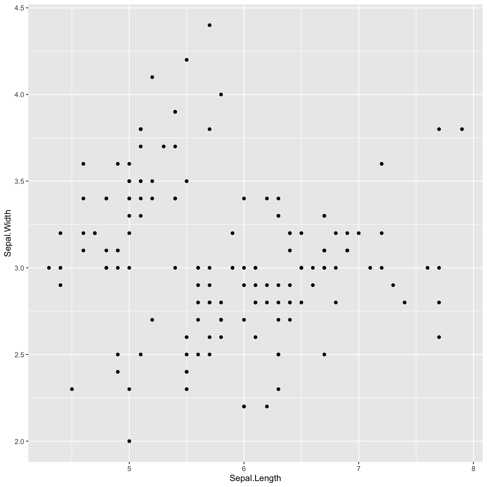

**Notes**

- Anything you put in the `ggplot()` function can be seen by any geom layers
  that you add (i.e., these are universal plot settings). This includes the x- and
  y-axis mapping you set up in `aes()`.
- You can also specify mappings for a given geom independently of the
  mappings defined globally in the `ggplot()` function.
- The `+` sign used to add new layers must be placed at the end of the line containing
the *previous* layer. If, instead, the `+` sign is added at the beginning of the line
containing the new layer, **`ggplot2`** will not add the new layer and will return an 
error message.


~~~
# This is the correct syntax for adding layers
iris_plot +
  geom_point()

# This will not add the new layer and will return an error message
iris_plot
  + geom_point()
~~~
{: .language-r}

## Building your plots iteratively

Building plots with **`ggplot2`** is typically an iterative process. We start by
defining the dataset we'll use, lay out the axes, and choose a geom:


~~~
ggplot(data = iris, 
       mapping = aes(x = Sepal.Width, 
                     y = Sepal.Length))+
    geom_point()
~~~
{: .language-r}

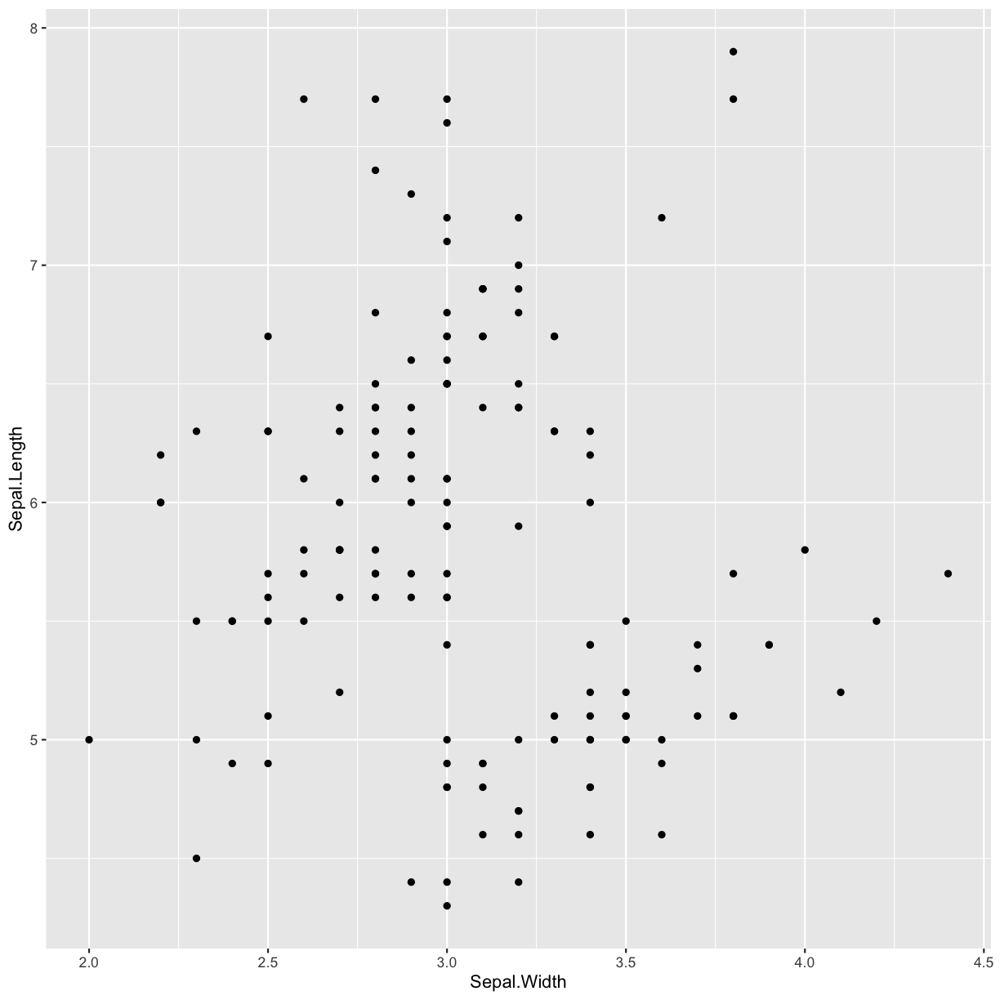

We can also add colors for all the points:


~~~
ggplot(data = iris, 
       mapping = aes(x = Sepal.Width, 
                     y = Sepal.Length))+
    geom_point(color = "blue")
~~~
{: .language-r}

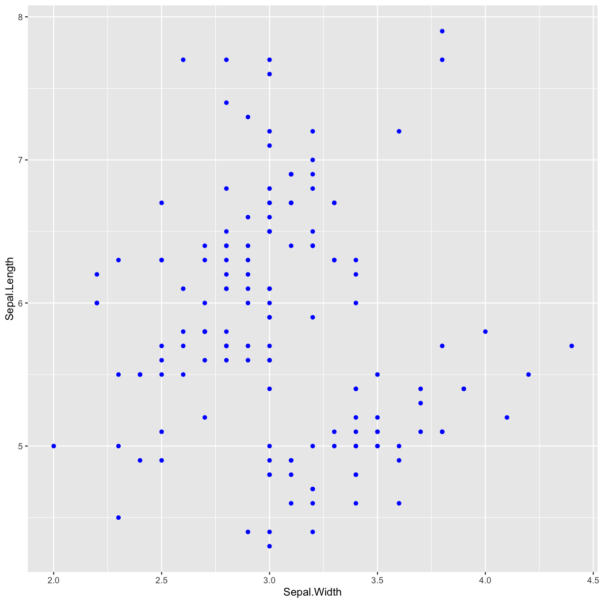

Or to color each species in the plot differently, you could use a vector as an input to the argument **color**. **`ggplot2`** will provide a different color corresponding to different values in the vector. Here is an example where we color with **`species`**:


~~~
ggplot(data = iris, 
       mapping = aes(x = Sepal.Width, 
                     y = Sepal.Length))+
    geom_point(aes(color = Species))
~~~
{: .language-r}

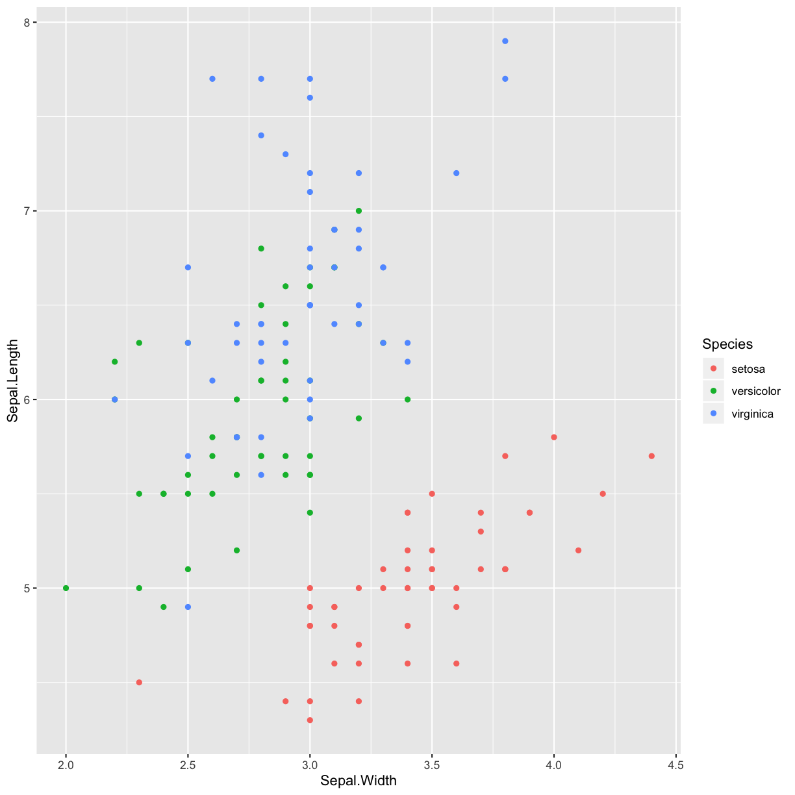

We can also specify the colors directly inside the mapping provided in the `ggplot()` function. This will be seen by any geom layers and the mapping will be determined by the x- and y-axis set up in `aes()`.


~~~
ggplot(data = iris, 
       mapping = aes(x = Sepal.Width, 
                     y = Sepal.Length, 
                     color = Species))+
    geom_point()
~~~
{: .language-r}


Notice that we can change the geom layer and colors will be still determined by **`species`**


~~~
ggplot(data = iris, 
       mapping = aes(x = Sepal.Width, 
                     y = Sepal.Length, 
                     color = Species))+
    geom_jitter()
~~~
{: .language-r}

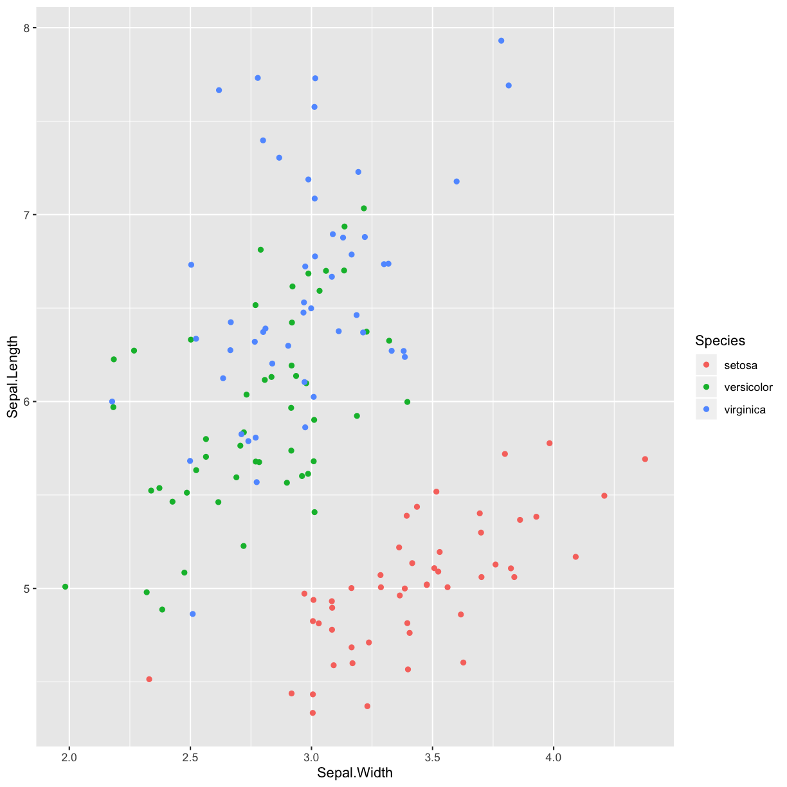

> ## Challenge 1
>
> Use what you just learned to create a scatter plot. Use these skills to plot the of the `phys_data` dataset. 
> Plot `Cond_day` over `Cond_night` with the species showing in different colors. Is this a good way to show this type of data?
>
> > ## Solution to Challenge 1
> > 
> > ~~~
> > ggplot(data = phys_data, 
> >        mapping = aes(x = Cond_day, 
> >                      y = Cond_night)) +
> >    geom_point(aes(color = Species))
> > ~~~
> > {: .language-r}
> > 
> > 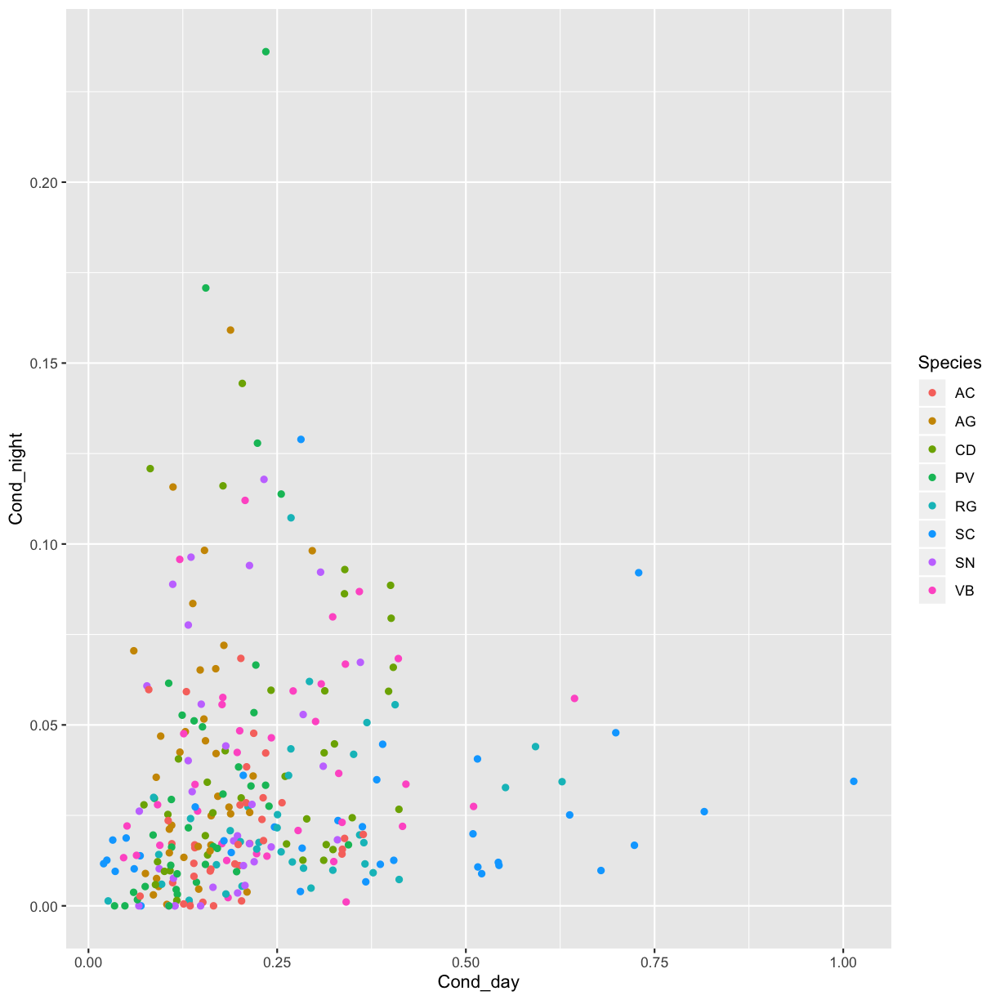
> {: .solution}
{: .challenge}

## Boxplot

We can use boxplots to visualize the distribution of sepal length within each species:


~~~
ggplot(data = iris, 
       mapping = aes(x = Species, 
                     y = Sepal.Length)) +
    geom_boxplot()
~~~
{: .language-r}

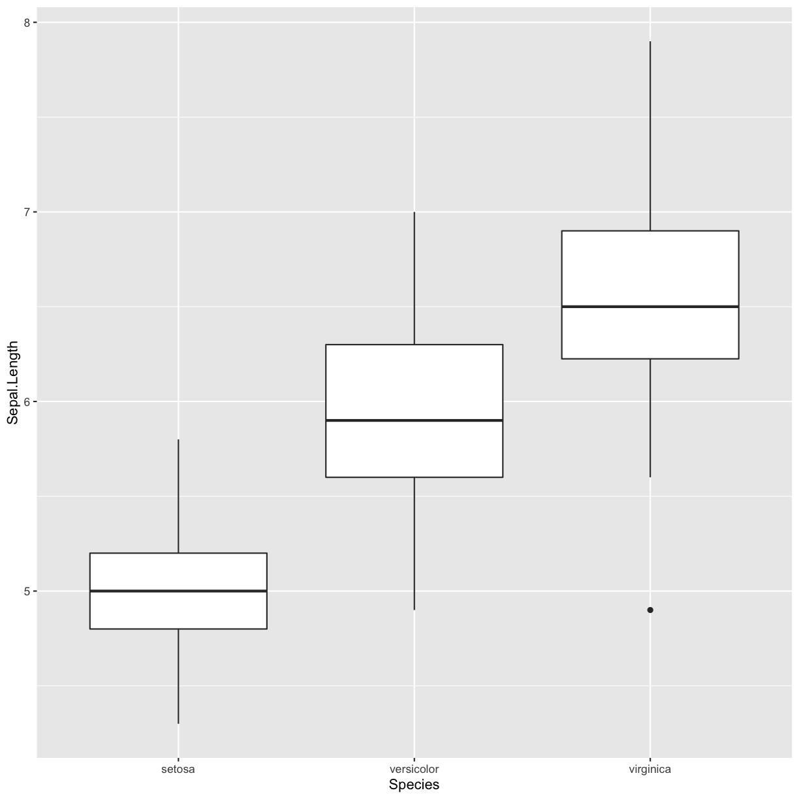

By adding points to boxplot, we can have a better idea of the number of
measurements and of their distribution:


~~~
ggplot(data = iris, 
       mapping = aes(x = Species, 
                     y = Sepal.Length)) +
    geom_boxplot()+
    geom_jitter(color = "tomato")
~~~
{: .language-r}

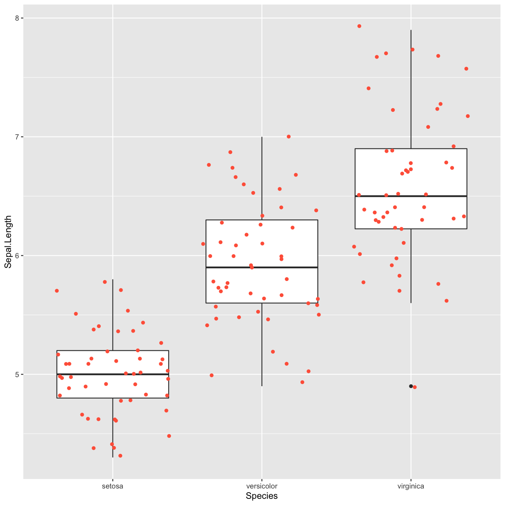

Notice how the boxplot layer is behind the jitter layer? What do you need to
change in the code to put the boxplot in front of the points such that it's not
hidden?

### The violin plot: an alternative to the boxplot

Boxplots are useful summaries, but hide the *shape* of the distribution. For example, if the distribution is bimodal, we would not see it in a boxplot. An alternative to the boxplot is the violin plot, where the shape (of the density of points) is drawn.

> ## Challenge 2
>
> Try replacing the box plot with a violin plot with `geom_violin()`.
>
> > ## Solution to Challenge 2
> > 
> > ~~~
> >       ggplot(data = iris, 
> >              mapping = aes(x = Species, 
> >                            y = Sepal.Length)) +
> >       geom_violin()
> > ~~~
> > {: .language-r}
> > 
> > 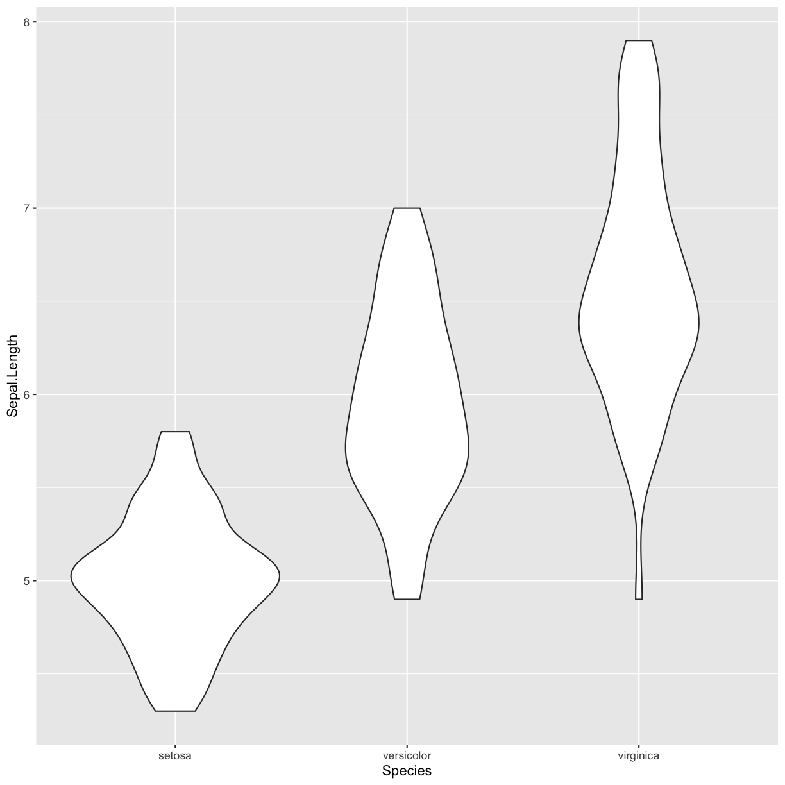
> {: .solution}
{: .challenge}

Now, let's try a box plot with some new data.

> ## Challenge 3
>
> * Create a boxplot for `Petal.Length`. 
> * Overlay the boxplot layer on a jitter layer to show actual measurements.
> *  Add color to the data points on your boxplot according to 
> `species`.
>
> > ## Solution to Challenge 3
> > 
> > ~~~
> >      ggplot(data = iris, 
> >             mapping = aes(x = Species, 
> >                           y = Petal.Length)) +
> >      geom_boxplot()+
> >      geom_jitter(color = "tomato")
> > ~~~
> > {: .language-r}
> > 
> > 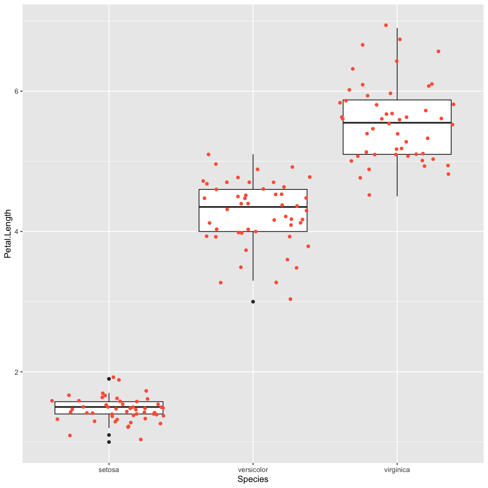
> {: .solution}
{: .challenge}

## Plotting time series data

Let's calculate the average photosynthesis rate per month for each Functional group (`Fgroup`). First we need to group the data and calculate the mean photosynthesis measurement within each group:


~~~
monthly_photo_fg <- phys_data %>%
  group_by(Month, Fgroup)%>%
  summarize(mean_phot = mean(Photo))
~~~
{: .language-r}

Time series data can be visualized as a line plot with years on the x axis and counts on the y axis:


~~~
ggplot(data = monthly_photo_fg, 
       mapping = aes(x = Month, 
                     y = mean_phot)) +
     geom_line()
~~~
{: .language-r}

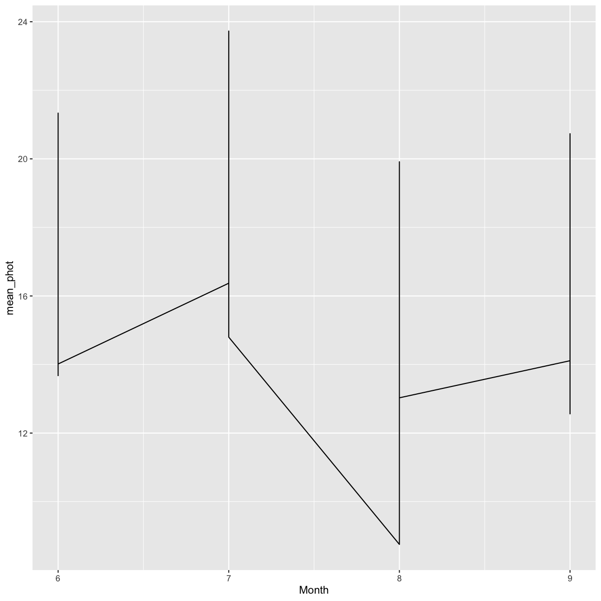

Unfortunately, this does not work because we plotted data for all the functional groups together. We need to tell ggplot to draw a line for each species by modifying the aesthetic function to include `group = Species`:


~~~
ggplot(data = monthly_photo_fg, 
       mapping = aes(x = Month, 
                     y = mean_phot, 
                     group = Fgroup)) +
     geom_line()
~~~
{: .language-r}


We will be able to distinguish species in the plot if we add colors (using `color` also automatically groups the data):


~~~
ggplot(data = monthly_photo_fg, 
       mapping = aes(x = Month, 
                     y = mean_phot, 
                     color = Fgroup)) +
     geom_line()
~~~
{: .language-r}

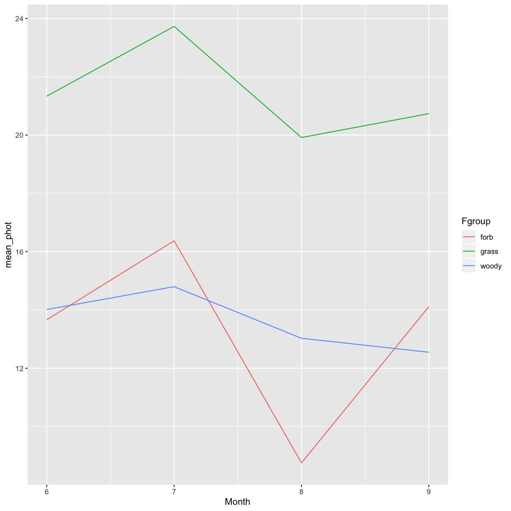

## Faceting

**`ggplot2`** has a special technique called *faceting* that allows the user to split one
plot into multiple plots based on a factor included in the dataset. We will use it to
make a time series plot for each species:


~~~
ggplot(data = monthly_photo_fg, 
       mapping = aes(x = Month, 
                     y = mean_phot)) +
     geom_line()+
    facet_wrap(~ Fgroup)
~~~
{: .language-r}

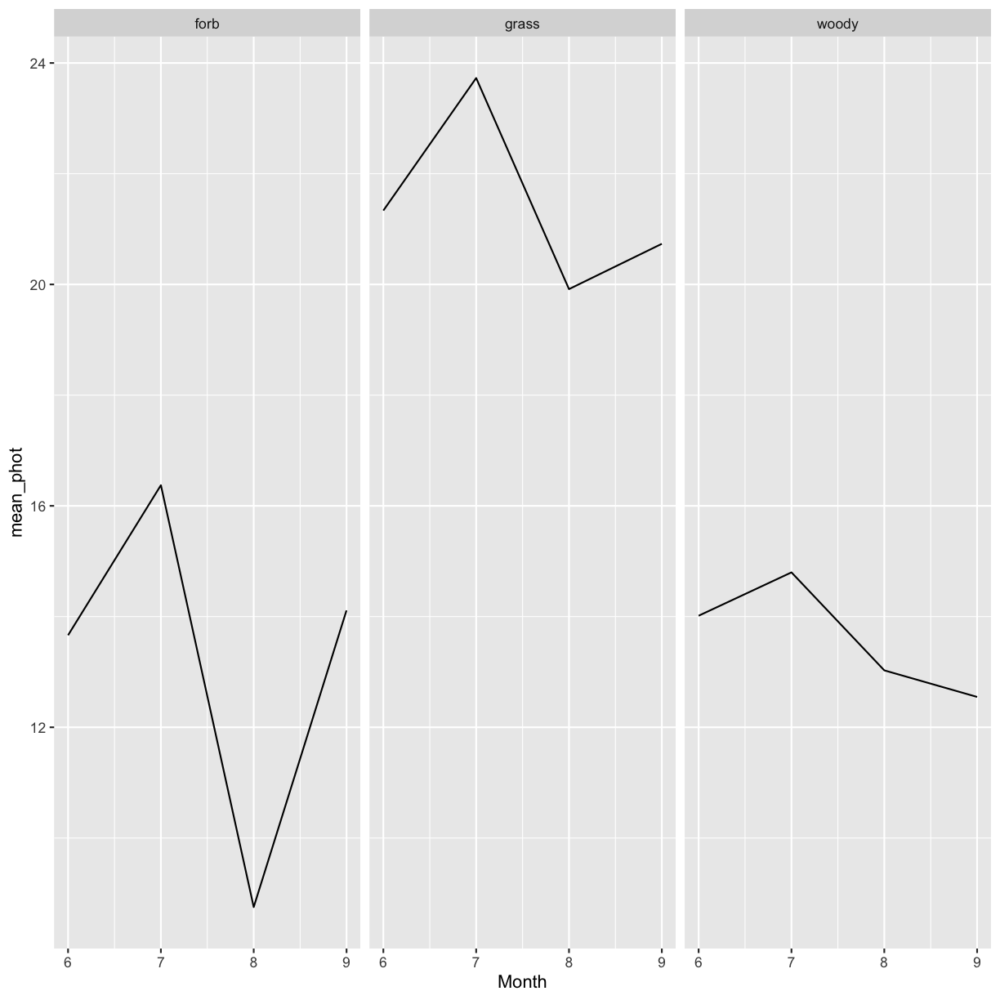

Now we would like to split the line in each plot by the species within each functional group. To do that we need to calculate means in the data frame grouped by `month`, `Species`, and `Fgroup`:


~~~
mo_sp_fg <- phys_data %>%
  group_by(Month, Species, Fgroup)%>%
  summarize(mean_phot = mean(Photo))
~~~
{: .language-r}

We can now make the faceted plot by splitting further by species using `color` (within a single plot):


~~~
ggplot(data = mo_sp_fg, 
       mapping = aes(x = Month, 
                     y = mean_phot, 
                     color = Species)) +
     geom_line()+
    facet_wrap(~ Fgroup) 
~~~
{: .language-r}

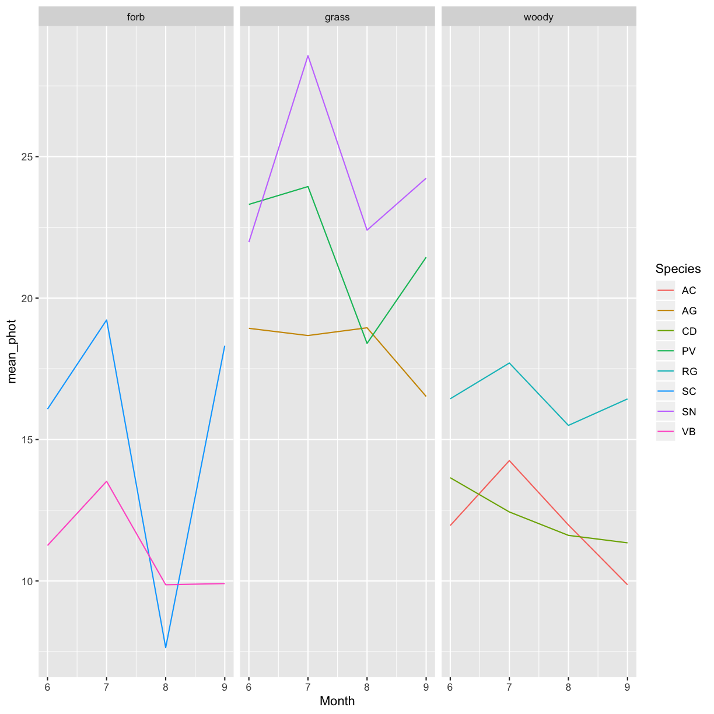

Usually plots with white background look more readable when printed.  We can set
the background to white using the function `theme_bw()`. Additionally, you can remove
the grid:


~~~
ggplot(data = mo_sp_fg, 
       mapping = aes(x = Month, 
                     y = mean_phot, 
                     color = Species)) +
     geom_line()+
    facet_wrap(~ Fgroup) +
     theme_bw() +
     theme(panel.grid = element_blank())
~~~
{: .language-r}

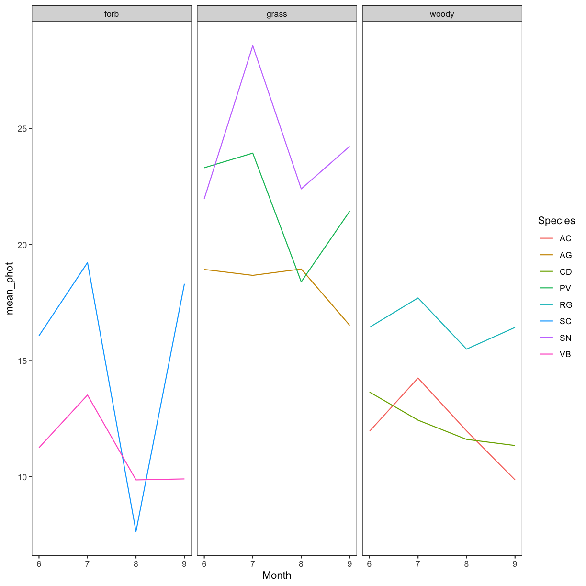

## **`ggplot2`** themes

In addition to `theme_bw()`, which changes the plot background to white, **`ggplot2`**
comes with several other themes which can be useful to quickly change the look
of your visualization. The complete list of themes is available
at <https://ggplot2.tidyverse.org/reference/ggtheme.html>. `theme_minimal()` and
`theme_light()` are popular, and `theme_void()` can be useful as a starting
point to create a new hand-crafted theme.

The
[ggthemes](https://jrnold.github.io/ggthemes/reference/index.html) package
provides a wide variety of options (including an Excel 2003 theme).
The [**`ggplot2`** extensions website](https://www.ggplot2-exts.org) provides a list
of packages that extend the capabilities of **`ggplot2`**, including additional
themes.
 

> ## Challenge 4
>
> Use what you just learned to create a plot that depicts how the average `MD`
> of each species changes over a season. Color the lines by functional group.
> 
> > ## Solution to Challenge 4
> > 
> > ~~~
> >          seasonCond <- phys_data %>%
> >                group_by(Month, Species, Fgroup) %>%
> >                summarize(avg_cond = mean(Percent_cond))
> > 
> >         ggplot(data = seasonCond, 
> >                mapping = aes(x=Month, 
> >                              y=avg_cond, 
> >                              color = Fgroup)) +
> >         geom_line() +
> >         facet_wrap(~ Species) +
> >         theme_bw()
> > ~~~
> > {: .language-r}
> > 
> > 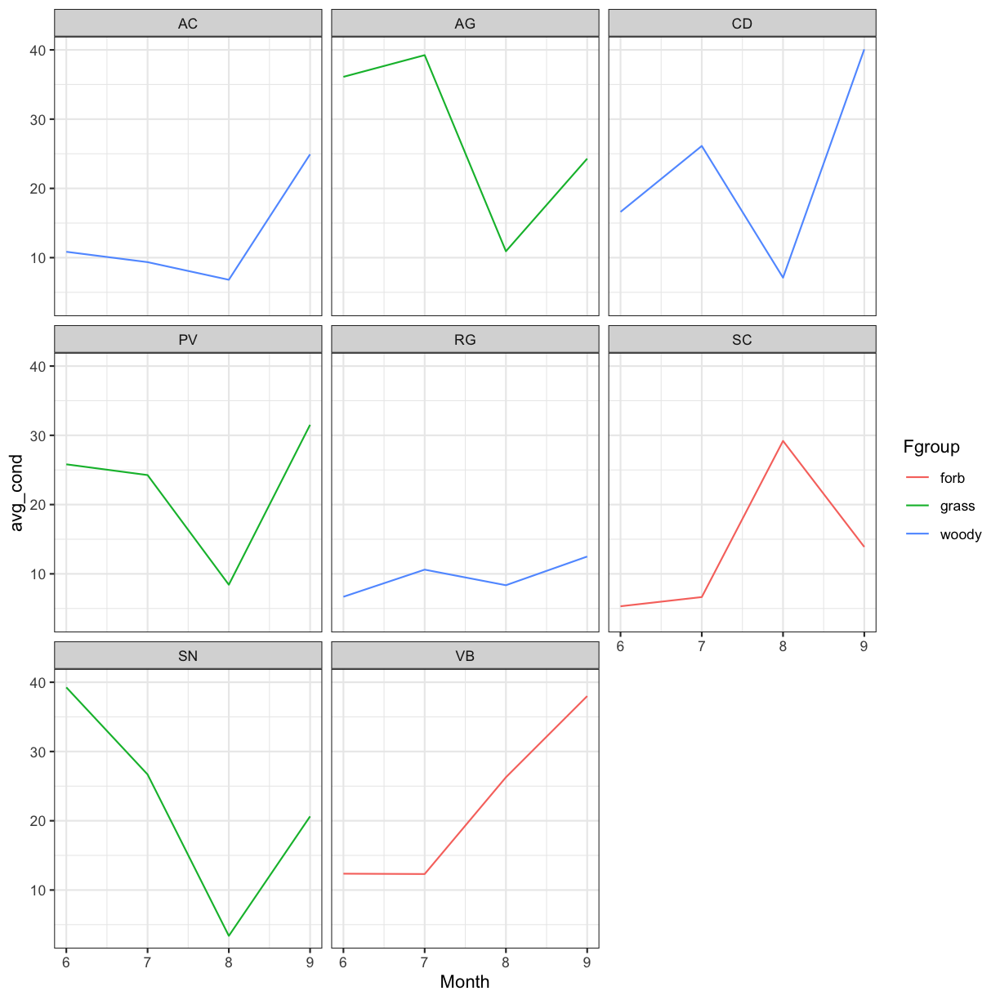
> {: .solution}
{: .challenge}

The `facet_wrap` geometry extracts plots into an arbitrary number of dimensions
to allow them to cleanly fit on one page. On the other hand, the `facet_grid`
geometry allows you to explicitly specify how you want your plots to be
arranged via formula notation (`rows ~ columns`; a `.` can be used as
a placeholder that indicates only one row or column).

Let's modify the previous plot to compare how the photosynthesis rate of functional
groups have changed through time:


~~~
ggplot(data = mo_sp_fg, 
       mapping = aes(x = Month, 
                     y = mean_phot, 
                     color = Species)) +
    geom_line() +
    facet_grid(Fgroup ~ .)
~~~
{: .language-r}

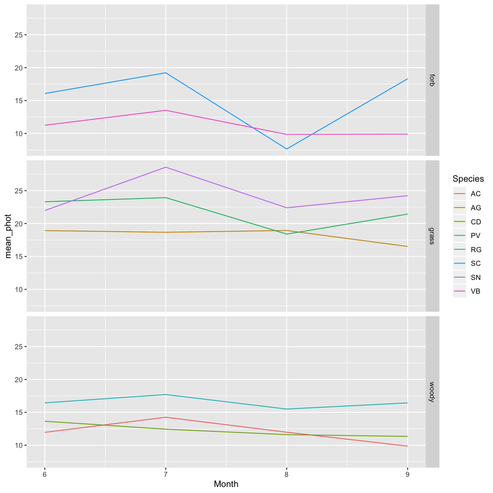


~~~
# One row, facet by column
ggplot(data = mo_sp_fg, 
       mapping = aes(x = Month, 
                     y = mean_phot, 
                     color = Species)) +
    geom_line() +
    facet_grid(.~ Fgroup)
~~~
{: .language-r}


## Customization

Take a look at the [**`ggplot2`** cheat sheet](https://github.com/rstudio/cheatsheets/raw/master/data-visualization-2.1.pdf), and
think of ways you could improve the plot.

Now, let's change names of axes to something more informative than 'year'
and 'n' and add a title to the figure:


~~~
ggplot(data = mo_sp_fg, 
       mapping = aes(x = Month, 
                     y = mean_phot, 
                     color = Species)) +
     geom_line()+
    facet_wrap(~ Fgroup) +
    labs(title = "Average photosynthesis over a season",
         x = "Month of observation",
         y = "Mean photosynthesis") +
    theme_bw()
~~~
{: .language-r}

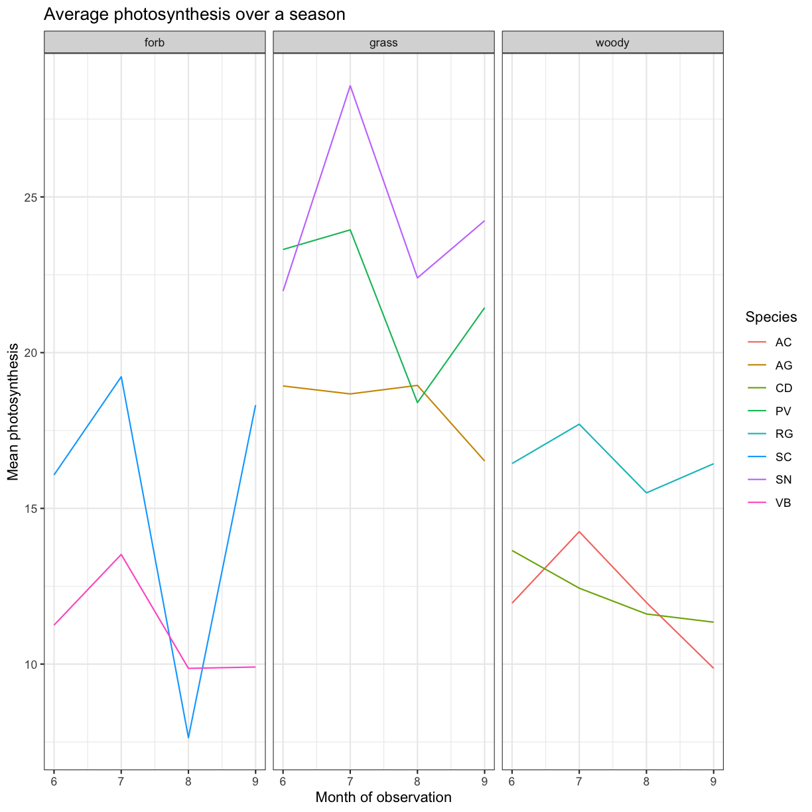

The axes have more informative names, but their readability can be improved by
increasing the font size:


~~~
ggplot(data = mo_sp_fg, 
       mapping = aes(x = Month, 
                     y = mean_phot, 
                     color = Species)) +
     geom_line()+
    facet_wrap(~ Fgroup) +
    labs(title = "Average photosynthesis over a season",
         x = "Month of observation",
         y = "Mean photosynthesis") +
    theme_bw() +
    theme(text=element_text(size = 16))
~~~
{: .language-r}

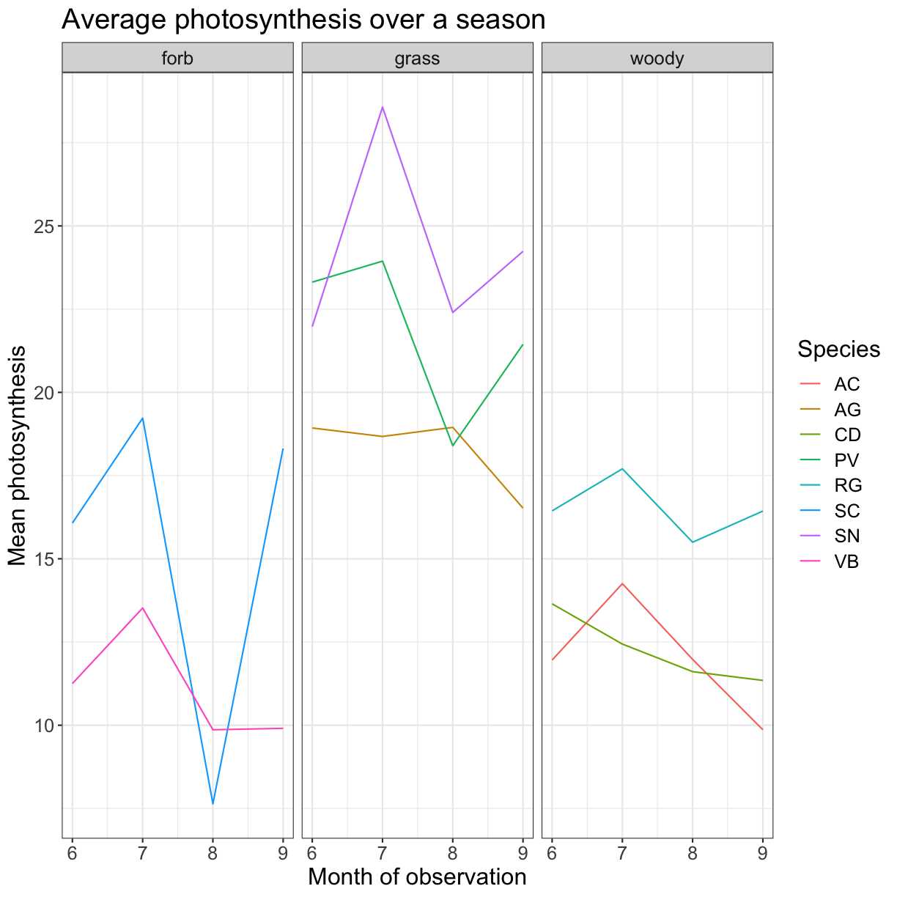

Note that it is also possible to change the fonts of your plots. If you are on
Windows, you may have to install
the [**`extrafont`** package](https://github.com/wch/extrafont), and follow the
instructions included in the README for this package.

After our manipulations, you may notice that the values on the x-axis are still not
properly readable. Let's change the orientation of the labels and adjust them
vertically and horizontally so they don't overlap. You can use a 90-degree
angle, or experiment to find the appropriate angle for diagonally oriented
labels:


~~~
ggplot(data = mo_sp_fg, 
       mapping = aes(x = Month, 
                     y = mean_phot, 
                     color = Species)) +
     geom_line()+
    facet_wrap(~ Fgroup) +
    labs(title = "Average photosynthesis over a season",
         x = "Month of observation",
         y = "Mean photosynthesis") +
    theme_bw() +
    theme(axis.text.x = element_text(color = "grey20", 
                                     size = 12, angle = 90, 
                                     hjust = 0.5, vjust = 0.5),
                        axis.text.y = element_text(colour = "grey20", size = 12),
          text = element_text(size = 16))
~~~
{: .language-r}

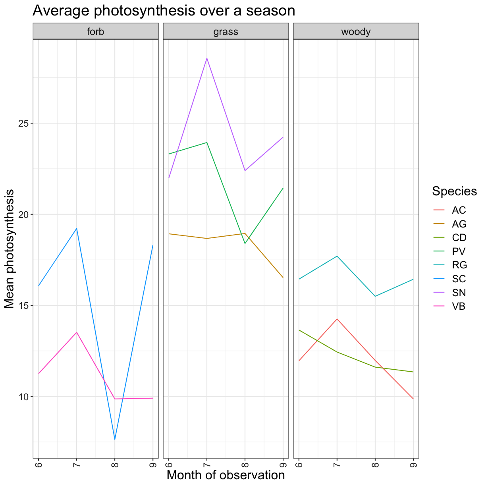

If you like the changes you created better than the default theme, you can save them as
an object to be able to easily apply them to other plots you may create:


~~~
grey_theme <- theme(axis.text.x = element_text(colour = "grey20", size = 12, angle = 90, hjust = 0.5, vjust = 0.5),
                          axis.text.y = element_text(colour = "grey20", size = 12),
                          text = element_text(size = 16))
ggplot(phys_data, 
       aes(x = Species, 
           y = Photo)) +
    geom_boxplot() +
    grey_theme
~~~
{: .language-r}


## Arranging and exporting plots

Faceting is a great tool for splitting one plot into multiple plots, but sometimes you may want to produce a single figure that contains multiple plots using different variables or even different data frames. The **`gridExtra`** package allows us to combine separate ggplots into a single figure using `grid.arrange()`:


~~~
install.packages("gridExtra")
~~~
{: .language-r}


~~~
library(gridExtra)

sp_photo_boxplot <- ggplot(phys_data, 
       aes(x = Species, 
           y = Photo)) +
    geom_boxplot() +
    grey_theme

sp_photo_line<-ggplot(data = mo_sp_fg, 
       mapping = aes(x = Month, 
                     y = mean_phot, 
                     color = Species)) +
     geom_line()+
    facet_wrap(~ Fgroup) +
    labs(title = "Average photosynthesis over a season",
         x = "Month of observation",
         y = "Mean photosynthesis") +
    grey_theme

grid.arrange(sp_photo_boxplot, sp_photo_line, ncol = 2, widths = c(4, 6))
~~~
{: .language-r}

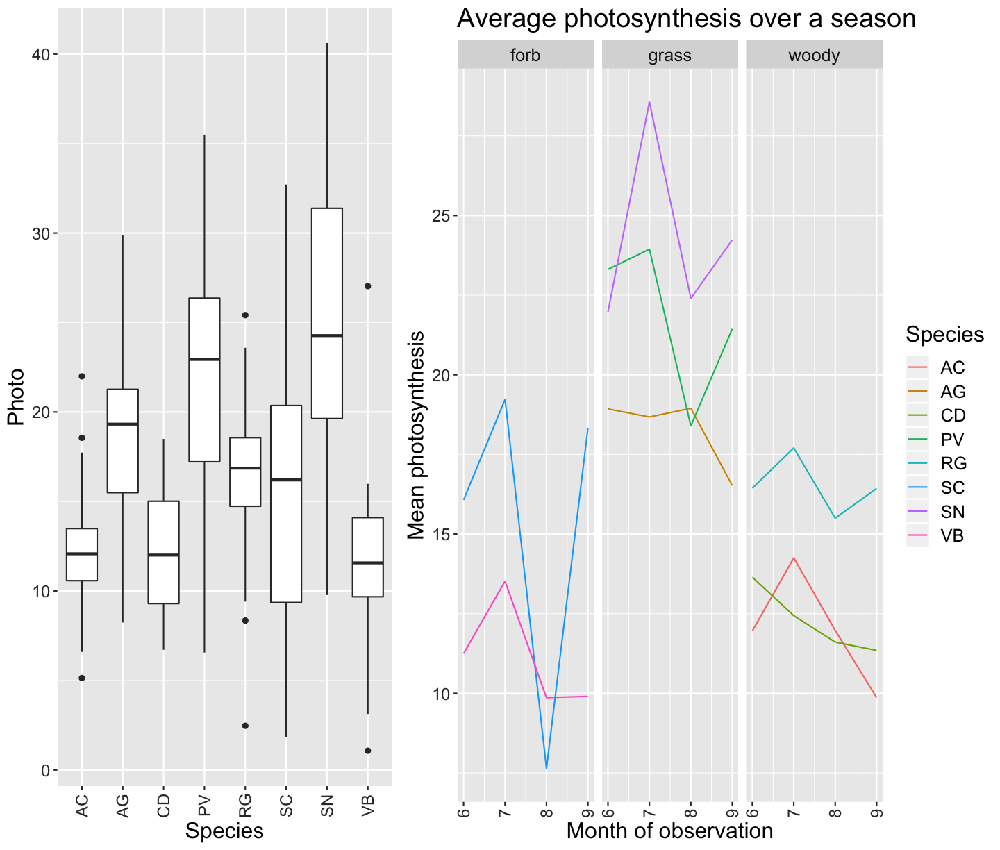

In addition to the `ncol` and `nrow` arguments, used to make simple arrangements, there are tools for [constructing more complex layouts](https://cran.r-project.org/web/packages/gridExtra/vignettes/arrangeGrob.html). 

After creating your plot, you can save it to a file in your favorite format. The Export tab in the **Plot** pane in RStudio will save your plots at low resolution, which will not be accepted by many journals and will not scale well for posters. 

Instead, use the `ggsave()` function, which allows you easily change the dimension and resolution of your plot by adjusting the appropriate arguments (`width`, `height` and `dpi`). 

Make sure you have the `fig_output/` folder in your working directory.


~~~
my_plot <- ggplot(phys_data, 
       aes(x = Species, 
           y = Photo)) +
    geom_boxplot() +
    grey_theme
  
ggsave("fig_output/boxplot.png", my_plot, width = 15, height = 10)

# This also works for grid.arrange() plots
combo_plot <- 
grid.arrange(sp_photo_boxplot, sp_photo_line, ncol = 2, widths = c(4, 6))

ggsave("fig_output/combo_plot.png", combo_plot, width = 10, height = 5,  dpi = 300)
~~~
{: .language-r}

Note: The parameters `width` and `height` also determine the font size in the saved plot.

> ## Final Plotting Challenge
> With all of this information in hand, please take another five
> minutes to either improve one of the plots generated in this
> exercise or create a beautiful graph of your own. Use the RStudio
> ggplot2 cheat sheet for inspiration:
> https://www.rstudio.com/wp-content/uploads/2015/08/ggplot2-cheatsheet.pdf
> Here are some ideas:
> * See if you can change the thickness of the lines.
> * Can you find a way to change the name of the legend? What about its labels?
> * Try using a different color palette (see
>   http://www.cookbook-r.com/Graphs/Colors_(ggplot2)/).
{: .challenge}
