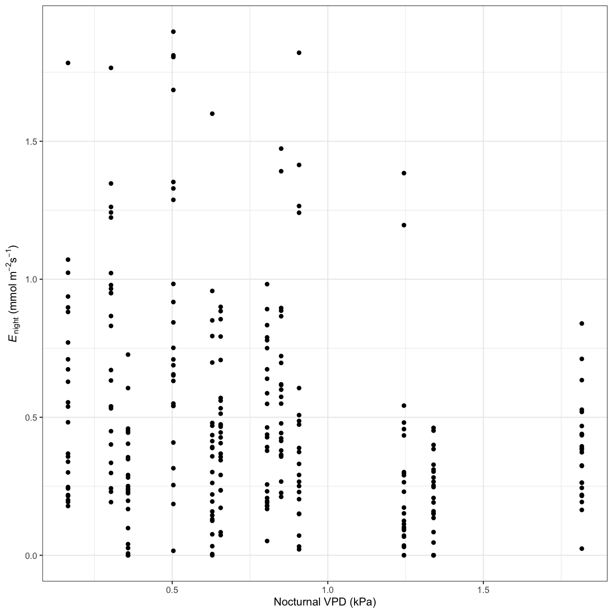
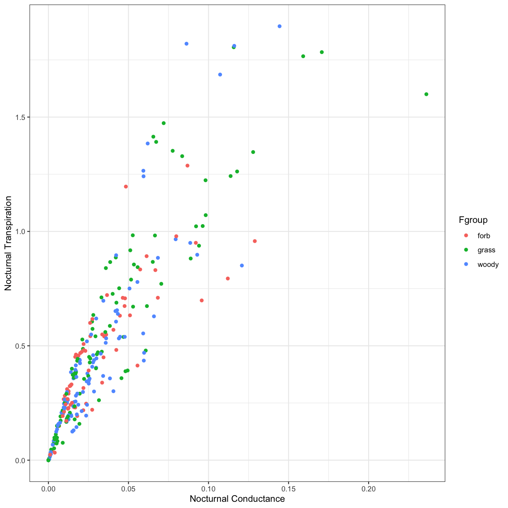

---
# Please do not edit this file directly; it is auto generated.
# Instead, please edit 05-advanced-lesson.md in _episodes_rmd/
title: 'Investigating large datasets in R'
author: "Data Carpentry Contributors"
teaching: 
exercises: 
questions:
- How can we evaluate direct relationships between two variables?
- How can we evaluate more complex relationships between multiple, interacting variables?
objectives: 
- Explore a large dataset graphically
- Develop simple models with `lm()`
- Choose new packages and interpret package descriptions
- Analyze complex models using Information Theoretic (IT) Model Averaging (`arm` and `MuMIn` packages)
keypoints: 
- Linear regression is a quick and easy way to evaluate the direct relationship between two variables.
- IT Model Averaging is one approach to evaluate more complex relationships between variables.
- There are often many valid approaches to address a question in R, and understanding how to interpret R packages can help determine which approach might be most appropriate.
source: Rmd
---

### Setup
Let's begin by loading the data and packages necessary to start this lesson.

~~~
# Load packages
library(ggplot2)

# Load data
phys_data<-read.csv("data/Physiology_Environmental_Data.csv")
~~~
{: .language-r}

### Exploring the dataset
In previous lessons we've worked with the plant physiology dataset from O'Keefe and Nippert 2018. As a reminder, these data were collected to address the following objectives:

1. How do nocturnal and daytime transpiration vary among coexisting grasses, forbs, and shrubs in a tallgrass prairie? 
2. What environmental variables drive nocturnal transpiration and do these differ from the drivers of daytime transpiration?
3. Are nocturnal transpiration and stomatal conductance associated with daytime physiological processes?

Let's use this dataset to explore the relationships between **leaf transpiration** and potential **drivers** of transpiration

**Transpiration parameters:**

1. Nocturnal transpiration (Trmmol_night)
2. Nocturnal stomatal conductance (Cond_night)
3. Daytime transpiration (Trmmol_day)
4. Daytime stomatal conductance (Cond_night)

**Potential drivers:**

1. Nocturnal vapor pressure deficit (VPD_N)
2. Nocturnal air temperature (TAIR_N)
3. Daytime vapor pressure deficit (VPD_D)
4. Daytime air temperature (TAIR_D)
5. Daily average soil moisture (Soil_moisture)
6. Predawn leaf water potential (PD)
7. Midday leaf water potential (MD)
8. Photosynthesis (Photo)
9. Plant functional group (Fgroup)

> ## Challenge 1
>
> Use ggplot to create a scatterplot of the relationship between a transpiration parameter and a potential driver.
>
> > ## Solution to  Challenge 1
> > 
> > 
> > ~~~
> > # Nocturnal transpiration vs. nocturnal VPD
> > ggplot(phys_data, aes(x=VPD_N, y=Trmmol_night)) +
> >   geom_point() +
> >   xlab("Nocturnal VPD (kPa)") +
> >   ylab(expression(paste(italic('E')[night]," ", "(mmol"," ",m^-2,s^-1,")"))) +
> >  theme_bw() 
> > ~~~
> > {: .language-r}
> > 
> > 
> {: .solution}
{: .challenge}

> ## Challenge 2
>
>How does this relationship differ between the different plant functional groups (grass, forb, woody)?
>
> > ## Solution to Challenge 2
> > 
> > ~~~
> > ggplot(phys_data, aes(x=VPD_N, y=Trmmol_night, color=Fgroup)) +
> >  geom_point() +
> >  xlab("Nocturnal VPD") +
> >  ylab(expression(paste(italic('E')[night]," ", "(mmol"," ",m^-2,s^-1,")"))) +
> >  theme_bw()
> > ~~~
> > {: .language-r}
> > 
> > 
> {: .solution}
{: .challenge}

### Using a Simple Model
As you can see, plotting our data can be informative, but it doesn't necessarily tell us much about the statistical relationships between variables. We are going to start investigate the relationships between these data by using a simple **linear regression.** Linear regression is used to predict the value of a dependent variable **Y** based on one or more input independent (predictor) variables **X**, with the following basic equation:

 $$y  = \beta_1 + \beta_2 X + \epsilon$$
 
In this equation, $$y$$ is the dependent variable, $$\beta_1$$ is the intercept, $$\beta_2$$ is the slope, and $$\epsilon$$ is the error term.

To build this equation in R, we'll use the `lm()` function. `lm()` is included in the base R package, so you don't have to load it into your workspace to use. `lm()` takes three basic arguments: the dependent variable, the independent variable, and the dataframe from which the data is used. The model is specified using a particular format, and is typically assigned to an object:

`model_name <- lm(dependent_variable ~ independent_variable, data=dataframe_name )`

We can then view our model output with the `summary()` function. 

~~~
fit_vpd <- lm(Trmmol_night ~ VPD_N, data=phys_data)
summary(fit_vpd)
~~~
{: .language-r}

~~~

Call:
lm(formula = Trmmol_night ~ VPD_N, data = phys_data)

Residuals:
     Min       1Q   Median       3Q      Max 
-0.57027 -0.27667 -0.07503  0.15594  1.36699 

Coefficients:
            Estimate Std. Error t value Pr(>|t|)    
(Intercept)  0.64619    0.04504  14.346  < 2e-16 ***
VPD_N       -0.21200    0.04880  -4.344 1.96e-05 ***
---
Signif. codes:  0 '***' 0.001 '**' 0.01 '*' 0.05 '.' 0.1 ' ' 1

Residual standard error: 0.3792 on 280 degrees of freedom
Multiple R-squared:  0.06313,	Adjusted R-squared:  0.05979 
F-statistic: 18.87 on 1 and 280 DF,  p-value: 1.96e-05
~~~
{: .output}

From this output, we're usually interested in the following results:

- `(Intercept) Estimate`: This is the y-intercept of our regression

- `VPD_N Estimate`: This is the slope of our regression

- `Std. Error`: The standard error for our intercept and slope estimates

- `Pr(>|t|)`: These are the p-values associated with the intercept and our independent variable

- `Multiple R-squared`: The $$r^2$$ value that indicates model fit

- `F-statistic` and `p-value`: Indicate overall model significance

### More Complex Models
Now that we know how to test for the effect of one variable on the dependent variable, let's test for the effect of *multiple* variables on the dependent variable. You can add additional variables to your model by using the following formula:

`model_name <- lm(dependent_variable ~ independent_variable_1 * independent_variable_2, data=dataframe_name )`

Note that adding an asterisk `*` between the two independent variables indicates that we will be testing for the effects of independent variable 1, independent variable 2, and their interaction on the dependent variable. If we were not interested in testing for interactions among independent variables, we could replace the `*` with a `+` sign.

> ## Challenge 3
>
> Create a model that tests for the effects of four factors on either transpiration or stomatal conductance.
>
> > ## Solution to Challenge 3
> >
> >~~~
> > fit_all <- lm(Trmmol_night ~ VPD_N * TAIR_N * Soil_moisture * Fgroup, data=phys_data)
> > summary(fit_all)
> >~~~
> >{: .language-r}
> >
> >
> >
> >~~~
> >
> >Call:
> >lm(formula = Trmmol_night ~ VPD_N * TAIR_N * Soil_moisture * 
> >    Fgroup, data = phys_data)
> >
> >Residuals:
> >     Min       1Q   Median       3Q      Max 
> >-0.79840 -0.20271 -0.05773  0.12702  1.42836 
> >
> >Coefficients:
> >                                         Estimate Std. Error t value
> >(Intercept)                             -4.224992   3.607216  -1.171
> >VPD_N                                    2.809890   6.789476   0.414
> >TAIR_N                                   0.269662   0.188632   1.430
> >Soil_moisture                           24.056256  23.860637   1.008
> >Fgroupgrass                             -2.300135   4.622194  -0.498
> >Fgroupwoody                              2.784390   4.582030   0.608
> >VPD_N:TAIR_N                            -0.177891   0.287298  -0.619
> >VPD_N:Soil_moisture                     -7.433865  52.156806  -0.143
> >TAIR_N:Soil_moisture                    -1.408985   1.231951  -1.144
> >VPD_N:Fgroupgrass                        6.761417   8.445400   0.801
> >VPD_N:Fgroupwoody                        0.766499   8.434074   0.091
> >TAIR_N:Fgroupgrass                       0.134513   0.243379   0.553
> >TAIR_N:Fgroupwoody                      -0.172222   0.240418  -0.716
> >Soil_moisture:Fgroupgrass               28.520689  30.394684   0.938
> >Soil_moisture:Fgroupwoody              -13.406242  30.119156  -0.445
> >VPD_N:TAIR_N:Soil_moisture               0.661956   2.176396   0.304
> >VPD_N:TAIR_N:Fgroupgrass                -0.318487   0.359046  -0.887
> >VPD_N:TAIR_N:Fgroupwoody                 0.008865   0.357972   0.025
> >VPD_N:Soil_moisture:Fgroupgrass        -75.146534  64.206261  -1.170
> >VPD_N:Soil_moisture:Fgroupwoody        -16.251816  64.126051  -0.253
> >TAIR_N:Soil_moisture:Fgroupgrass        -1.426020   1.582136  -0.901
> >TAIR_N:Soil_moisture:Fgroupwoody         0.882050   1.561290   0.565
> >VPD_N:TAIR_N:Soil_moisture:Fgroupgrass   3.315745   2.691432   1.232
> >VPD_N:TAIR_N:Soil_moisture:Fgroupwoody   0.417599   2.684198   0.156
> >                                       Pr(>|t|)
> >(Intercept)                               0.243
> >VPD_N                                     0.679
> >TAIR_N                                    0.154
> >Soil_moisture                             0.314
> >Fgroupgrass                               0.619
> >Fgroupwoody                               0.544
> >VPD_N:TAIR_N                              0.536
> >VPD_N:Soil_moisture                       0.887
> >TAIR_N:Soil_moisture                      0.254
> >VPD_N:Fgroupgrass                         0.424
> >VPD_N:Fgroupwoody                         0.928
> >TAIR_N:Fgroupgrass                        0.581
> >TAIR_N:Fgroupwoody                        0.474
> >Soil_moisture:Fgroupgrass                 0.349
> >Soil_moisture:Fgroupwoody                 0.657
> >VPD_N:TAIR_N:Soil_moisture                0.761
> >VPD_N:TAIR_N:Fgroupgrass                  0.376
> >VPD_N:TAIR_N:Fgroupwoody                  0.980
> >VPD_N:Soil_moisture:Fgroupgrass           0.243
> >VPD_N:Soil_moisture:Fgroupwoody           0.800
> >TAIR_N:Soil_moisture:Fgroupgrass          0.368
> >TAIR_N:Soil_moisture:Fgroupwoody          0.573
> >VPD_N:TAIR_N:Soil_moisture:Fgroupgrass    0.219
> >VPD_N:TAIR_N:Soil_moisture:Fgroupwoody    0.876
> >
> >Residual standard error: 0.3611 on 258 degrees of freedom
> >Multiple R-squared:  0.2172,	Adjusted R-squared:  0.1474 
> >F-statistic: 3.113 on 23 and 258 DF,  p-value: 5.543e-06
> >~~~
> >{: .output}
> {: .solution}
{: .challenge}

### How to Work with Complex Models: IT Model Averaging
As you can see, we have a lot of potential interactions with just four independent variables in our model! This becomes incredibly difficult to interpret, so we often have to look for other methods to analyze complex relationships in our data.

Although there are many different and valid ways to approach a statistical problem, today we are going to use *Information Theoretic (IT) Model Averaging*. Rather than creating a model with all possible variables and interactions, IT Model Averaging:

- Compares mulitple competing models using information criteria

- Ranks and weights each competing model

- Averages a top model set to produce a final model that only includes predictor variables represented in the top model set

IT Model Averaging quantifies multiple competing hypotheses and is better able to avoid over-parameterization than traditional methods using a single model. To get started, we need to create a "global model" that includes all possible predictor variables. To simplify things even further, let's only consider pairwise interactions among predictors. For this, R syntax supports polynomial expansions: you can write the terms as an additive model, then place the set of terms for which you want pairwise interactions in parentheses and square the sum, as in (x + y)^2.

`model_name <- lm(dependent_variable ~ (independent_variable_1 + independent_variable_2)^2, data=dataframe_name )`

~~~
# Global model
fit_IT <- lm(Trmmol_night ~ (VPD_N + TAIR_N + Soil_moisture + Fgroup)^2, data=phys_data)
~~~
{: .language-r}

**IT Model Averaging** requires the following packages:
- `arm`: Includes the `standardize()` function that standardizes the input variables
- `MuMIn`: The `dredge()` function creates a full submodel set, the `get.models()` function creates a top model set, and `model.avg()` creates the average model and `importance()` calculates relative importance. 

Let's install and load these packages before we begin:

~~~
# Install packages
install.packages("arm")
install.packages("MuMIn")
~~~
{: .language-r}

~~~
# Load packages
library(arm)
library(MuMIn)
~~~
{: .language-r}
Before we start using these functions, let's take a look at the package descriptions for [arm](https://cran.r-project.org/web/packages/arm/arm.pdf) and [MuMIn](https://cran.r-project.org/web/packages/MuMIn/MuMIn.pdf)

**Note:** When reading package descriptions, it is important to:

- Read the overall package description. This will give you a good overall idea of what this package does, and if it would be useful for you.

- Identify particular functions of interest. You don't necessarily need to read the documentation for all of the functions within a package (typically, you'll only use a few functions).

- For individual functions, read through the basic description, usage, argument descriptions, details / notes, and examples. This will tell you what syntax to use and what the syntax means. 

- You can access package descriptions online (google search), from the CRAN website, or by using the `help()` function in R.

First, let's standardize our input variables with the `standardize()` function in the `arm` package. `standardize()` rescales numeric variables that take on more than two values to have a mean of 0 and a standard deviation of 0.5. To do this, we just need to specify the object to standardize (our global model, `fit_IT`):

~~~
# Standardize the global model

stdz.model<-standardize(fit_IT)
summary(stdz.model)
~~~
{: .language-r}

Next, we create the full submodel set with the `dredge()` function in the `MuMIn` package by specifying the object that `dredge()` will evaluate (our standardized model, `stdz.model`). We also need to change the default "na.omit" to prevent models from being fitted to different datasets in case of missing values using `options(na.action=na.fail) `:

~~~
options(na.action=na.fail) 
model.set<-dredge(stdz.model)
~~~
{: .language-r}

The `get.models()` function will then create a top model set. First, we need to specify the object that `get.models` will evaluate (our model set, `model.set`), and then we need to specify the subset of models to include all models within 4AICcs with `subset=delta<4`:

~~~
top.models<-get.models(model.set, subset=delta<4)
top.models
~~~
{: .language-r}

Finally, we'll use the `model.avg()` function to create our average model and calculates relative importance. We need to specify the object that `model.avg()` will evaluate (in this case our top model set, `top.models`):

~~~
average_model<-model.avg(top.models)
~~~
{: .language-r}

To check out our final average model, use the `summary()` function:

~~~
summary(average_model)
~~~
{: .language-r}

This is a lot of information! We can see which component models were chosen as the top model set and then averaged, as well as their associated ranking information. We can also see the model-averaged coefficients for both the full average model and conditional average model.

The *conditional average* only averages over the models where the parameter appears. Conversely, the *full average* assumes that a variable is included in every model, but in some models the corresponding coefficient (and its respective variance) is set to zero. Unlike the *conditional average*, the *full average* does not bias the value away from zero.

We can also check out the relative importance of each factor within the model with the `importance()` function. Relative importance is a unitless metric ranging from 0 (doesn't contribute to the model at all) to 1 (contributes heavily to the model). This function will also give use the number of models within the top model set that contain each factor.

~~~
importance(average_model)
~~~
{: .language-r}

> ## Challenge 4
> Using IT Model Averaging, create a model that tests for the effects of four factors on either transpiration or stomatal conductance. Then, create a plot that best illustrates the main finding of your top model. Ultimately, your results should be able to address one of these questions:
>
> - What environmental variables drive nocturnal transpiration / stomatal conductance, and do these differ from the drivers of daytime transpiration / stomatal conductance?
> - Are nocturnal transpiration and stomatal conductance associated with daytime physiological processes?
{: .challenge}

