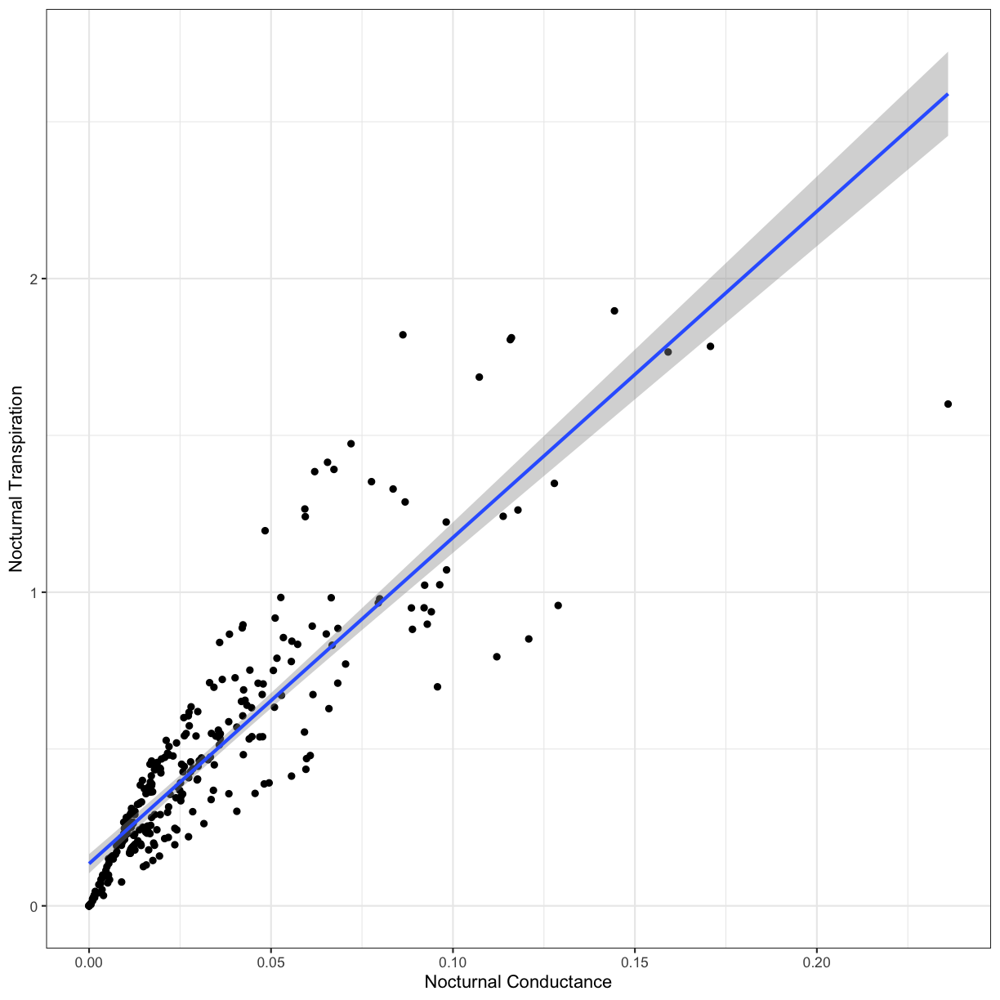

### Setup
Let's begin by loading the data and packages necessary to start this lesson.

~~~
# Load packages
library(ggplot2)

# Load data
phys_data<-read.csv("data/Physiology_Environmental_Data.csv")
~~~
{: .language-r}

### Exploring the dataset
In previous lessons we've worked with the plant physiology dataset from O'Keefe and Nippert 2018. As a reminder, these data were collected to address the following objectives:

1. How do nocturnal and daytime transpiration vary among coexisting grasses, forbs, and shrubs in a tallgrass prairie? 
2. What environmental variables drive nocturnal transpiration and do these differ from the drivers of daytime transpiration?
3. Are nocturnal transpiration and stomatal conductance associated with daytime physiological processes?

We'll use this dataset to explore the relationships between **leaf transpiration** and potential **drivers** of transpiration

**Transpiration parameters:**

1. Nocturnal transpiration (Trmmol_night)
2. Nocturnal stomatal conductance (Cond_night)
3. Daytime transpiration (Trmmol_day)
4. Daytime stomatal conductance (Cond_night)

**Potential drivers:**

1. Nocturnal vapor pressure deficit (VPD_N)
2. Nocturnal air temperature (TAIR_N)
3. Daytime vapor pressure deficit (VPD_D)
4. Daytime air temperature (TAIR_D)
5. Daily average soil moisture (Soil_moisture)
6. Predawn leaf water potential (PD)
7. Midday leaf water potential (MD)
8. Photosynthesis (Photo)
9. Plant functional group (Fgroup)

First, let's review plotting in `ggplot` and investigate the relationship between nocturnal transpiration and nocturnal stomatal conductance.

> ## Challenge 1
>
> Use ggplot to create a scatterplot of the relationship between nocturnal transpiration and nocturnal stomatal conductance.
>
> > ## Solution to  Challenge 1
> > 
> > 
> > ~~~
> > # Nocturnal transpiration vs. nocturnal stomatal conductance
> > ggplot(phys_data, aes(x=Cond_night, y=Trmmol_night)) +
> >  geom_point() +
> >  xlab("Nocturnal Conductance") +
> >  ylab("Nocturnal Transpiration") +
> >  theme_bw() 
> > ~~~
> > {: .language-r}
> > 
> > 
> {: .solution}
{: .challenge}

> ## Challenge 2
>
>Does this relationship differ between the different plant functional groups (grass, forb, woody)?
>
> > ## Solution to Challenge 2
> > 
> > ~~~
> > ggplot(phys_data, aes(x=Cond_night, y=Trmmol_night, color=Fgroup)) +
> >  geom_point() +
> >  xlab("Nocturnal Conductance") +
> >  ylab("Nocturnal Transpiration") +
> >  theme_bw()
> > ~~~
> > {: .language-r}
> > 
> > 
> {: .solution}
{: .challenge}

### Using a Simple Model
As you can see, plotting our data can be informative, but it doesn't necessarily tell us much about the statistical relationships between variables. We are going to start investigate the relationships between these data by using a simple **linear regression.** Linear regression is used to predict the value of a dependent variable **Y** based on one or more input independent (predictor) variables **X**, with the following basic equation:

 $$y  = \beta_1 + \beta_2 X + \epsilon$$
 
In this equation, $$y$$ is the dependent variable, $$\beta_1$$ is the intercept, $$\beta_2$$ is the slope, and $$\epsilon$$ is the error term.

To build this equation in R, we'll use the `lm()` function. `lm()` is included in the base R package, so you don't have to load it into your workspace to use. `lm()` takes three basic arguments: the dependent variable, the independent variable, and the dataframe from which the data is used. The model is specified using a particular format, and is typically assigned to an object:

`model_name <- lm(dependent_variable ~ independent_variable, data=dataframe_name )`

We can then view our model output with the `summary()` function. 

~~~
fit_trmmol <- lm(Trmmol_night ~ Cond_night, data=phys_data)
summary(fit_trmmol)
~~~
{: .language-r}

~~~

Call:
lm(formula = Trmmol_night ~ Cond_night, data = phys_data)

Residuals:
     Min       1Q   Median       3Q      Max 
-0.98937 -0.09752 -0.01945  0.07498  0.78951 

Coefficients:
            Estimate Std. Error t value Pr(>|t|)    
(Intercept)  0.13433    0.01548    8.68 3.31e-16 ***
Cond_night  10.39960    0.33128   31.39  < 2e-16 ***
---
Signif. codes:  0 '***' 0.001 '**' 0.01 '*' 0.05 '.' 0.1 ' ' 1

Residual standard error: 0.1843 on 280 degrees of freedom
Multiple R-squared:  0.7787,	Adjusted R-squared:  0.778 
F-statistic: 985.5 on 1 and 280 DF,  p-value: < 2.2e-16
~~~
{: .output}

From this output, we're usually interested in the following results:

- `(Intercept) Estimate`: This is the y-intercept of our regression

- `VPD_N Estimate`: This is the slope of our regression

- `Std. Error`: The standard error for our intercept and slope estimates

- `Pr(>|t|)`: These are the p-values associated with the intercept and our independent variable

- `Multiple R-squared`: The $$r^2$$ value that indicates model fit

- `F-statistic` and `p-value`: Indicate overall model significance

As you can see, there is a significant positive relationship between nocturnal transpiration and nocturnal conductance. This makes sense; as plant stomata open, more water can escape from the leaf. Let's visual this regression on our scatterplot with `geom_smooth()`:

~~~
ggplot(phys_data, aes(x=Cond_night, y=Trmmol_night)) +
  geom_point() +
  geom_smooth(method='lm') +
  xlab("Nocturnal Conductance") +
  ylab("Nocturnal Transpiration") +
  theme_bw() 
~~~
{: .language-r}

### More Complex Models
Now that we know how to test for the effect of one variable on the dependent variable, let's test for the effect of *multiple* variables on the dependent variable. This will be especially useful for understanding what drives nocturnal transpiration and nocturnal conductance, as there are likely multiple, interacting drivers for these parameters.

You can add additional variables to your model by using the following formula:

`model_name <- lm(dependent_variable ~ independent_variable_1 * independent_variable_2, data=dataframe_name )`

Note that adding an asterisk `*` between the two independent variables indicates that we will be testing for the effects of independent variable 1, independent variable 2, and their interaction on the dependent variable. If we were not interested in testing for interactions among independent variables, we could replace the `*` with a `+` sign.

> ## Challenge 3
>
> Create a model that tests for the effects of four factors on either transpiration or stomatal conductance.
>
> > ## Solution to Challenge 3
> >
> >~~~
> > fit_all <- lm(Trmmol_night ~ VPD_N * TAIR_N * Soil_moisture * Fgroup, data=phys_data)
> > summary(fit_all)
> >~~~
> >{: .language-r}
> >
> >
> >
> >~~~
> >
> >Call:
> >lm(formula = Trmmol_night ~ VPD_N * TAIR_N * Soil_moisture * 
> >    Fgroup, data = phys_data)
> >
> >Residuals:
> >     Min       1Q   Median       3Q      Max 
> >-0.79840 -0.20271 -0.05773  0.12702  1.42836 
> >
> >Coefficients:
> >                                         Estimate Std. Error t value
> >(Intercept)                             -4.224992   3.607216  -1.171
> >VPD_N                                    2.809890   6.789476   0.414
> >TAIR_N                                   0.269662   0.188632   1.430
> >Soil_moisture                           24.056256  23.860637   1.008
> >Fgroupgrass                             -2.300135   4.622194  -0.498
> >Fgroupwoody                              2.784390   4.582030   0.608
> >VPD_N:TAIR_N                            -0.177891   0.287298  -0.619
> >VPD_N:Soil_moisture                     -7.433865  52.156806  -0.143
> >TAIR_N:Soil_moisture                    -1.408985   1.231951  -1.144
> >VPD_N:Fgroupgrass                        6.761417   8.445400   0.801
> >VPD_N:Fgroupwoody                        0.766499   8.434074   0.091
> >TAIR_N:Fgroupgrass                       0.134513   0.243379   0.553
> >TAIR_N:Fgroupwoody                      -0.172222   0.240418  -0.716
> >Soil_moisture:Fgroupgrass               28.520689  30.394684   0.938
> >Soil_moisture:Fgroupwoody              -13.406242  30.119156  -0.445
> >VPD_N:TAIR_N:Soil_moisture               0.661956   2.176396   0.304
> >VPD_N:TAIR_N:Fgroupgrass                -0.318487   0.359046  -0.887
> >VPD_N:TAIR_N:Fgroupwoody                 0.008865   0.357972   0.025
> >VPD_N:Soil_moisture:Fgroupgrass        -75.146534  64.206261  -1.170
> >VPD_N:Soil_moisture:Fgroupwoody        -16.251816  64.126051  -0.253
> >TAIR_N:Soil_moisture:Fgroupgrass        -1.426020   1.582136  -0.901
> >TAIR_N:Soil_moisture:Fgroupwoody         0.882050   1.561290   0.565
> >VPD_N:TAIR_N:Soil_moisture:Fgroupgrass   3.315745   2.691432   1.232
> >VPD_N:TAIR_N:Soil_moisture:Fgroupwoody   0.417599   2.684198   0.156
> >                                       Pr(>|t|)
> >(Intercept)                               0.243
> >VPD_N                                     0.679
> >TAIR_N                                    0.154
> >Soil_moisture                             0.314
> >Fgroupgrass                               0.619
> >Fgroupwoody                               0.544
> >VPD_N:TAIR_N                              0.536
> >VPD_N:Soil_moisture                       0.887
> >TAIR_N:Soil_moisture                      0.254
> >VPD_N:Fgroupgrass                         0.424
> >VPD_N:Fgroupwoody                         0.928
> >TAIR_N:Fgroupgrass                        0.581
> >TAIR_N:Fgroupwoody                        0.474
> >Soil_moisture:Fgroupgrass                 0.349
> >Soil_moisture:Fgroupwoody                 0.657
> >VPD_N:TAIR_N:Soil_moisture                0.761
> >VPD_N:TAIR_N:Fgroupgrass                  0.376
> >VPD_N:TAIR_N:Fgroupwoody                  0.980
> >VPD_N:Soil_moisture:Fgroupgrass           0.243
> >VPD_N:Soil_moisture:Fgroupwoody           0.800
> >TAIR_N:Soil_moisture:Fgroupgrass          0.368
> >TAIR_N:Soil_moisture:Fgroupwoody          0.573
> >VPD_N:TAIR_N:Soil_moisture:Fgroupgrass    0.219
> >VPD_N:TAIR_N:Soil_moisture:Fgroupwoody    0.876
> >
> >Residual standard error: 0.3611 on 258 degrees of freedom
> >Multiple R-squared:  0.2172,	Adjusted R-squared:  0.1474 
> >F-statistic: 3.113 on 23 and 258 DF,  p-value: 5.543e-06
> >~~~
> >{: .output}
> {: .solution}
{: .challenge}

### How to Work with Complex Models: IT Model Averaging
As you can see, we have a lot of potential interactions with just four independent variables in our model! This becomes incredibly difficult to interpret, so we often have to look for other methods to analyze complex relationships in our data.

Although there are many different and valid ways to approach a statistical problem, today we are going to use *Information Theoretic (IT) Model Averaging*. Rather than creating a model with all possible variables and interactions, IT Model Averaging:

- Compares mulitple competing models using information criteria

- Ranks and weights each competing model

- Averages a top model set to produce a final model that only includes predictor variables represented in the top model set

IT Model Averaging quantifies multiple competing hypotheses and is better able to avoid over-parameterization than traditional methods using a single model. To get started, we need to create a "global model" that includes all possible predictor variables. To simplify things even further, let's only consider pairwise interactions among predictors. For this, R syntax supports polynomial expansions: you can write the terms as an additive model, then place the set of terms for which you want pairwise interactions in parentheses and square the sum, as in (x + y)^2.

`model_name <- lm(dependent_variable ~ (independent_variable_1 + independent_variable_2)^2, data=dataframe_name )`

~~~
# Global model
fit_IT <- lm(Trmmol_night ~ (VPD_N + TAIR_N + Soil_moisture + Fgroup)^2, data=phys_data)
~~~
{: .language-r}

**IT Model Averaging** requires the following packages:
- `arm`: Includes the `standardize()` function that standardizes the input variables
- `MuMIn`: The `dredge()` function creates a full submodel set, the `get.models()` function creates a top model set, and `model.avg()` creates the average model and `importance()` calculates relative importance. 

Let's install and load these packages before we begin:

~~~
# Install packages
install.packages("arm")
install.packages("MuMIn")
~~~
{: .language-r}

~~~
# Load packages
library(arm)
library(MuMIn)
~~~
{: .language-r}
Before we start using these functions, let's take a look at the package descriptions for [arm](https://cran.r-project.org/web/packages/arm/arm.pdf) and [MuMIn](https://cran.r-project.org/web/packages/MuMIn/MuMIn.pdf)

**Note:** When reading package descriptions, it is important to:

- Read the overall package description. This will give you a good overall idea of what this package does, and if it would be useful for you.

- Identify particular functions of interest. You don't necessarily need to read the documentation for all of the functions within a package (typically, you'll only use a few functions).

- For individual functions, read through the basic description, usage, argument descriptions, details / notes, and examples. This will tell you what syntax to use and what the syntax means. 

- You can access package descriptions online (google search), from the CRAN website, or by using the `help()` function in R.

First, let's standardize our input variables with the `standardize()` function in the `arm` package. `standardize()` rescales numeric variables that take on more than two values to have a mean of 0 and a standard deviation of 0.5. To do this, we just need to specify the object to standardize (our global model, `fit_IT`):

~~~
# Standardize the global model

stdz.model<-standardize(fit_IT)
summary(stdz.model)
~~~
{: .language-r}

~~~

Call:
lm(formula = Trmmol_night ~ (z.VPD_N + z.TAIR_N + z.Soil_moisture + 
    Fgroup)^2, data = phys_data)

Residuals:
     Min       1Q   Median       3Q      Max 
-0.69948 -0.21909 -0.06959  0.13788  1.48475 

Coefficients:
                            Estimate Std. Error t value Pr(>|t|)    
(Intercept)                  0.50765    0.06199   8.189  1.1e-14 ***
z.VPD_N                     -0.29681    0.18108  -1.639  0.10237    
z.TAIR_N                     0.25517    0.18549   1.376  0.17007    
z.Soil_moisture             -0.07790    0.09859  -0.790  0.43015    
Fgroupgrass                  0.08123    0.05679   1.430  0.15381    
Fgroupwoody                 -0.02886    0.05644  -0.511  0.60960    
z.VPD_N:z.TAIR_N            -0.12601    0.18162  -0.694  0.48841    
z.VPD_N:z.Soil_moisture      0.49627    0.26345   1.884  0.06069 .  
z.VPD_N:Fgroupgrass         -0.01030    0.20095  -0.051  0.95915    
z.VPD_N:Fgroupwoody          0.06443    0.20076   0.321  0.74853    
z.TAIR_N:z.Soil_moisture    -0.36228    0.23247  -1.558  0.12033    
z.TAIR_N:Fgroupgrass        -0.28903    0.20357  -1.420  0.15682    
z.TAIR_N:Fgroupwoody        -0.11230    0.20289  -0.554  0.58038    
z.Soil_moisture:Fgroupgrass  0.36120    0.12340   2.927  0.00372 ** 
z.Soil_moisture:Fgroupwoody  0.20905    0.12133   1.723  0.08606 .  
---
Signif. codes:  0 '***' 0.001 '**' 0.01 '*' 0.05 '.' 0.1 ' ' 1

Residual standard error: 0.366 on 267 degrees of freedom
Multiple R-squared:  0.1677,	Adjusted R-squared:  0.1241 
F-statistic: 3.844 on 14 and 267 DF,  p-value: 5.864e-06
~~~
{: .output}

Next, we create the full submodel set with the `dredge()` function in the `MuMIn` package by specifying the object that `dredge()` will evaluate (our standardized model, `stdz.model`). We also need to change the default "na.omit" to prevent models from being fitted to different datasets in case of missing values using `options(na.action=na.fail) `:

~~~
options(na.action=na.fail) 
model.set<-dredge(stdz.model)
~~~
{: .language-r}

The `get.models()` function will then create a top model set. First, we need to specify the object that `get.models` will evaluate (our model set, `model.set`), and then we need to specify the subset of models to include all models within 4AICcs with `subset=delta<4`:

~~~
top.models<-get.models(model.set, subset=delta<4)
top.models
~~~
{: .language-r}

~~~
$`92`

Call:
lm(formula = Trmmol_night ~ Fgroup + z.Soil_moisture + z.VPD_N + 
    Fgroup:z.Soil_moisture + Fgroup:z.VPD_N + 1, data = phys_data)

Coefficients:
                (Intercept)                  Fgroupgrass  
                    0.45599                      0.08474  
                Fgroupwoody              z.Soil_moisture  
                   -0.02706                     -0.05451  
                    z.VPD_N  Fgroupgrass:z.Soil_moisture  
                   -0.08277                      0.30260  
Fgroupwoody:z.Soil_moisture          Fgroupgrass:z.VPD_N  
                    0.18432                     -0.24586  
        Fgroupwoody:z.VPD_N  
                   -0.02848  

$`64`

Call:
lm(formula = Trmmol_night ~ Fgroup + z.Soil_moisture + z.TAIR_N + 
    z.VPD_N + Fgroup:z.Soil_moisture + Fgroup:z.TAIR_N + 1, data = phys_data)

Coefficients:
                (Intercept)                  Fgroupgrass  
                    0.45588                      0.08438  
                Fgroupwoody              z.Soil_moisture  
                   -0.02715                     -0.08780  
                   z.TAIR_N                      z.VPD_N  
                    0.13918                     -0.19087  
Fgroupgrass:z.Soil_moisture  Fgroupwoody:z.Soil_moisture  
                    0.37120                      0.19707  
       Fgroupgrass:z.TAIR_N         Fgroupwoody:z.TAIR_N  
                   -0.29612                     -0.05893  

$`348`

Call:
lm(formula = Trmmol_night ~ Fgroup + z.Soil_moisture + z.VPD_N + 
    Fgroup:z.Soil_moisture + Fgroup:z.VPD_N + z.Soil_moisture:z.VPD_N + 
    1, data = phys_data)

Coefficients:
                (Intercept)                  Fgroupgrass  
                    0.45795                      0.08526  
                Fgroupwoody              z.Soil_moisture  
                   -0.02673                     -0.06552  
                    z.VPD_N  Fgroupgrass:z.Soil_moisture  
                   -0.08653                      0.30382  
Fgroupwoody:z.Soil_moisture          Fgroupgrass:z.VPD_N  
                    0.18475                     -0.24589  
        Fgroupwoody:z.VPD_N      z.Soil_moisture:z.VPD_N  
                   -0.02866                      0.12475  

$`320`

Call:
lm(formula = Trmmol_night ~ Fgroup + z.Soil_moisture + z.TAIR_N + 
    z.VPD_N + Fgroup:z.Soil_moisture + Fgroup:z.TAIR_N + z.Soil_moisture:z.VPD_N + 
    1, data = phys_data)

Coefficients:
                (Intercept)                  Fgroupgrass  
                    0.45794                      0.08501  
                Fgroupwoody              z.Soil_moisture  
                   -0.02684                     -0.10473  
                   z.TAIR_N                      z.VPD_N  
                    0.16103                     -0.21286  
Fgroupgrass:z.Soil_moisture  Fgroupwoody:z.Soil_moisture  
                    0.37291                      0.19749  
       Fgroupgrass:z.TAIR_N         Fgroupwoody:z.TAIR_N  
                   -0.29570                     -0.05901  
    z.Soil_moisture:z.VPD_N  
                    0.13200  

$`448`

Call:
lm(formula = Trmmol_night ~ Fgroup + z.Soil_moisture + z.TAIR_N + 
    z.VPD_N + Fgroup:z.Soil_moisture + Fgroup:z.TAIR_N + z.Soil_moisture:z.TAIR_N + 
    z.Soil_moisture:z.VPD_N + 1, data = phys_data)

Coefficients:
                (Intercept)                  Fgroupgrass  
                    0.47927                      0.08242  
                Fgroupwoody              z.Soil_moisture  
                   -0.02782                     -0.09021  
                   z.TAIR_N                      z.VPD_N  
                    0.27560                     -0.31517  
Fgroupgrass:z.Soil_moisture  Fgroupwoody:z.Soil_moisture  
                    0.36516                      0.19614  
       Fgroupgrass:z.TAIR_N         Fgroupwoody:z.TAIR_N  
                   -0.29793                     -0.05876  
   z.Soil_moisture:z.TAIR_N      z.Soil_moisture:z.VPD_N  
                   -0.31673                      0.47275  

$`576`

Call:
lm(formula = Trmmol_night ~ Fgroup + z.Soil_moisture + z.TAIR_N + 
    z.VPD_N + Fgroup:z.Soil_moisture + Fgroup:z.TAIR_N + z.TAIR_N:z.VPD_N + 
    1, data = phys_data)

Coefficients:
                (Intercept)                  Fgroupgrass  
                    0.47783                      0.08378  
                Fgroupwoody              z.Soil_moisture  
                   -0.02791                     -0.07803  
                   z.TAIR_N                      z.VPD_N  
                    0.09672                     -0.14884  
Fgroupgrass:z.Soil_moisture  Fgroupwoody:z.Soil_moisture  
                    0.37079                      0.19602  
       Fgroupgrass:z.TAIR_N         Fgroupwoody:z.TAIR_N  
                   -0.29567                     -0.05873  
           z.TAIR_N:z.VPD_N  
                   -0.10768  

$`192`

Call:
lm(formula = Trmmol_night ~ Fgroup + z.Soil_moisture + z.TAIR_N + 
    z.VPD_N + Fgroup:z.Soil_moisture + Fgroup:z.TAIR_N + z.Soil_moisture:z.TAIR_N + 
    1, data = phys_data)

Coefficients:
                (Intercept)                  Fgroupgrass  
                    0.45319                      0.08509  
                Fgroupwoody              z.Soil_moisture  
                   -0.02685                     -0.09761  
                   z.TAIR_N                      z.VPD_N  
                    0.12938                     -0.18320  
Fgroupgrass:z.Soil_moisture  Fgroupwoody:z.Soil_moisture  
                    0.37325                      0.19748  
       Fgroupgrass:z.TAIR_N         Fgroupwoody:z.TAIR_N  
                   -0.29556                     -0.05901  
   z.Soil_moisture:z.TAIR_N  
                    0.05334  

$`96`

Call:
lm(formula = Trmmol_night ~ Fgroup + z.Soil_moisture + z.TAIR_N + 
    z.VPD_N + Fgroup:z.Soil_moisture + Fgroup:z.VPD_N + 1, data = phys_data)

Coefficients:
                (Intercept)                  Fgroupgrass  
                   0.455988                     0.084770  
                Fgroupwoody              z.Soil_moisture  
                  -0.027072                    -0.056180  
                   z.TAIR_N                      z.VPD_N  
                   0.006906                    -0.088422  
Fgroupgrass:z.Soil_moisture  Fgroupwoody:z.Soil_moisture  
                   0.302750                     0.184306  
        Fgroupgrass:z.VPD_N          Fgroupwoody:z.VPD_N  
                  -0.245816                    -0.028470  

$`28`

Call:
lm(formula = Trmmol_night ~ Fgroup + z.Soil_moisture + z.VPD_N + 
    Fgroup:z.Soil_moisture + 1, data = phys_data)

Coefficients:
                (Intercept)                  Fgroupgrass  
                    0.45664                      0.08483  
                Fgroupwoody              z.Soil_moisture  
                   -0.02766                     -0.06058  
                    z.VPD_N  Fgroupgrass:z.Soil_moisture  
                   -0.18548                      0.32165  
Fgroupwoody:z.Soil_moisture  
                    0.18544  

$`960`

Call:
lm(formula = Trmmol_night ~ Fgroup + z.Soil_moisture + z.TAIR_N + 
    z.VPD_N + Fgroup:z.Soil_moisture + Fgroup:z.TAIR_N + z.Soil_moisture:z.TAIR_N + 
    z.Soil_moisture:z.VPD_N + z.TAIR_N:z.VPD_N + 1, data = phys_data)

Coefficients:
                (Intercept)                  Fgroupgrass  
                    0.50762                      0.08122  
                Fgroupwoody              z.Soil_moisture  
                   -0.02891                     -0.07341  
                   z.TAIR_N                      z.VPD_N  
                    0.23841                     -0.27666  
Fgroupgrass:z.Soil_moisture  Fgroupwoody:z.Soil_moisture  
                    0.36323                      0.19463  
       Fgroupgrass:z.TAIR_N         Fgroupwoody:z.TAIR_N  
                   -0.29781                     -0.05847  
   z.Soil_moisture:z.TAIR_N      z.Soil_moisture:z.VPD_N  
                   -0.36274                      0.49676  
           z.TAIR_N:z.VPD_N  
                   -0.12583  

$`352`

Call:
lm(formula = Trmmol_night ~ Fgroup + z.Soil_moisture + z.TAIR_N + 
    z.VPD_N + Fgroup:z.Soil_moisture + Fgroup:z.VPD_N + z.Soil_moisture:z.VPD_N + 
    1, data = phys_data)

Coefficients:
                (Intercept)                  Fgroupgrass  
                    0.45806                      0.08540  
                Fgroupwoody              z.Soil_moisture  
                   -0.02677                     -0.07323  
                   z.TAIR_N                      z.VPD_N  
                    0.02900                     -0.11050  
Fgroupgrass:z.Soil_moisture  Fgroupwoody:z.Soil_moisture  
                    0.30455                      0.18470  
        Fgroupgrass:z.VPD_N          Fgroupwoody:z.VPD_N  
                   -0.24572                     -0.02864  
    z.Soil_moisture:z.VPD_N  
                    0.13274  

$`480`

Call:
lm(formula = Trmmol_night ~ Fgroup + z.Soil_moisture + z.TAIR_N + 
    z.VPD_N + Fgroup:z.Soil_moisture + Fgroup:z.VPD_N + z.Soil_moisture:z.TAIR_N + 
    z.Soil_moisture:z.VPD_N + 1, data = phys_data)

Coefficients:
                (Intercept)                  Fgroupgrass  
                    0.47893                      0.08287  
                Fgroupwoody              z.Soil_moisture  
                   -0.02772                     -0.05888  
                   z.TAIR_N                      z.VPD_N  
                    0.14039                     -0.21052  
Fgroupgrass:z.Soil_moisture  Fgroupwoody:z.Soil_moisture  
                    0.29655                      0.18346  
        Fgroupgrass:z.VPD_N          Fgroupwoody:z.VPD_N  
                   -0.24647                     -0.02811  
   z.Soil_moisture:z.TAIR_N      z.Soil_moisture:z.VPD_N  
                   -0.30990                      0.46615  

$`832`

Call:
lm(formula = Trmmol_night ~ Fgroup + z.Soil_moisture + z.TAIR_N + 
    z.VPD_N + Fgroup:z.Soil_moisture + Fgroup:z.TAIR_N + z.Soil_moisture:z.VPD_N + 
    z.TAIR_N:z.VPD_N + 1, data = phys_data)

Coefficients:
                (Intercept)                  Fgroupgrass  
                    0.46694                      0.08472  
                Fgroupwoody              z.Soil_moisture  
                   -0.02718                     -0.09950  
                   z.TAIR_N                      z.VPD_N  
                    0.14184                     -0.19383  
Fgroupgrass:z.Soil_moisture  Fgroupwoody:z.Soil_moisture  
                    0.37263                      0.19702  
       Fgroupgrass:z.TAIR_N         Fgroupwoody:z.TAIR_N  
                   -0.29554                     -0.05892  
    z.Soil_moisture:z.VPD_N             z.TAIR_N:z.VPD_N  
                    0.12291                     -0.04486  

$`284`

Call:
lm(formula = Trmmol_night ~ Fgroup + z.Soil_moisture + z.VPD_N + 
    Fgroup:z.Soil_moisture + z.Soil_moisture:z.VPD_N + 1, data = phys_data)

Coefficients:
                (Intercept)                  Fgroupgrass  
                    0.45859                      0.08534  
                Fgroupwoody              z.Soil_moisture  
                   -0.02733                     -0.07161  
                    z.VPD_N  Fgroupgrass:z.Soil_moisture  
                   -0.18932                      0.32287  
Fgroupwoody:z.Soil_moisture      z.Soil_moisture:z.VPD_N  
                    0.18588                      0.12490  

$`76`

Call:
lm(formula = Trmmol_night ~ Fgroup + z.Soil_moisture + z.VPD_N + 
    Fgroup:z.VPD_N + 1, data = phys_data)

Coefficients:
        (Intercept)          Fgroupgrass          Fgroupwoody  
            0.45595              0.08290             -0.02692  
    z.Soil_moisture              z.VPD_N  Fgroupgrass:z.VPD_N  
            0.12331             -0.07192             -0.26721  
Fgroupwoody:z.VPD_N  
           -0.03978  

$`332`

Call:
lm(formula = Trmmol_night ~ Fgroup + z.Soil_moisture + z.VPD_N + 
    Fgroup:z.VPD_N + z.Soil_moisture:z.VPD_N + 1, data = phys_data)

Coefficients:
            (Intercept)              Fgroupgrass              Fgroupwoody  
                0.45787                  0.08340                 -0.02660  
        z.Soil_moisture                  z.VPD_N      Fgroupgrass:z.VPD_N  
                0.11309                 -0.07558                 -0.26732  
    Fgroupwoody:z.VPD_N  z.Soil_moisture:z.VPD_N  
               -0.03998                  0.12241  

$`608`

Call:
lm(formula = Trmmol_night ~ Fgroup + z.Soil_moisture + z.TAIR_N + 
    z.VPD_N + Fgroup:z.Soil_moisture + Fgroup:z.VPD_N + z.TAIR_N:z.VPD_N + 
    1, data = phys_data)

Coefficients:
                (Intercept)                  Fgroupgrass  
                    0.47803                      0.08417  
                Fgroupwoody              z.Soil_moisture  
                   -0.02784                     -0.04644  
                   z.TAIR_N                      z.VPD_N  
                   -0.03549                     -0.04657  
Fgroupgrass:z.Soil_moisture  Fgroupwoody:z.Soil_moisture  
                    0.30246                      0.18331  
        Fgroupgrass:z.VPD_N          Fgroupwoody:z.VPD_N  
                   -0.24526                     -0.02805  
           z.TAIR_N:z.VPD_N  
                   -0.10814  

$`224`

Call:
lm(formula = Trmmol_night ~ Fgroup + z.Soil_moisture + z.TAIR_N + 
    z.VPD_N + Fgroup:z.Soil_moisture + Fgroup:z.VPD_N + z.Soil_moisture:z.TAIR_N + 
    1, data = phys_data)

Coefficients:
                (Intercept)                  Fgroupgrass  
                   0.453206                     0.085501  
                Fgroupwoody              z.Soil_moisture  
                  -0.026767                    -0.066327  
                   z.TAIR_N                      z.VPD_N  
                  -0.003009                    -0.080515  
Fgroupgrass:z.Soil_moisture  Fgroupwoody:z.Soil_moisture  
                   0.304973                     0.184703  
        Fgroupgrass:z.VPD_N          Fgroupwoody:z.VPD_N  
                  -0.245638                    -0.028639  
   z.Soil_moisture:z.TAIR_N  
                   0.054983  

attr(,"rank")
function (x) 
do.call("rank", list(x))
<environment: 0x7fd46a6294c0>
attr(,"call")
AICc(x)
attr(,"class")
[1] "function"     "rankFunction"
attr(,"beta")
[1] "none"
~~~
{: .output}

Finally, we'll use the `model.avg()` function to create our average model and calculates relative importance. We need to specify the object that `model.avg()` will evaluate (in this case our top model set, `top.models`):

~~~
average_model<-model.avg(top.models)
~~~
{: .language-r}

To check out our final average model, use the `summary()` function:

~~~
summary(average_model)
~~~
{: .language-r}

~~~

Call:
model.avg(object = top.models)

Component model call: 
lm(formula = Trmmol_night ~ <18 unique rhs>, data = phys_data)

Component models: 
                   df  logLik   AICc delta weight
1/2/4/5/7          10 -112.22 245.25  0.00   0.14
1/2/3/4/5/6        11 -111.24 245.46  0.21   0.12
1/2/4/5/7/9        11 -111.43 245.84  0.60   0.10
1/2/3/4/5/6/9      12 -110.40 245.95  0.71   0.10
1/2/3/4/5/6/8/9    13 -109.34 246.03  0.78   0.09
1/2/3/4/5/6/10     12 -111.02 247.20  1.95   0.05
1/2/3/4/5/6/8      12 -111.05 247.26  2.02   0.05
1/2/3/4/5/7        11 -112.21 247.40  2.16   0.05
1/2/4/5             8 -115.51 247.55  2.30   0.04
1/2/3/4/5/6/8/9/10 14 -109.08 247.74  2.49   0.04
1/2/3/4/5/7/9      12 -111.37 247.89  2.65   0.04
1/2/3/4/5/7/8/9    13 -110.36 248.07  2.83   0.03
1/2/3/4/5/6/9/10   13 -110.36 248.08  2.84   0.03
1/2/4/5/9           9 -114.74 248.14  2.90   0.03
1/2/4/7             8 -115.83 248.18  2.93   0.03
1/2/4/7/9           9 -115.09 248.84  3.60   0.02
1/2/3/4/5/7/10     12 -111.99 249.14  3.90   0.02
1/2/3/4/5/7/8      12 -112.01 249.19  3.94   0.02

Term codes: 
                  Fgroup          z.Soil_moisture                 z.TAIR_N 
                       1                        2                        3 
                 z.VPD_N   Fgroup:z.Soil_moisture          Fgroup:z.TAIR_N 
                       4                        5                        6 
          Fgroup:z.VPD_N z.Soil_moisture:z.TAIR_N  z.Soil_moisture:z.VPD_N 
                       7                        8                        9 
        z.TAIR_N:z.VPD_N 
                      10 

Model-averaged coefficients:  
(full average) 
                            Estimate Std. Error Adjusted SE z value
(Intercept)                  0.46320    0.04822     0.04842   9.566
Fgroupgrass                  0.08429    0.05677     0.05703   1.478
Fgroupwoody                 -0.02724    0.05644     0.05670   0.480
z.Soil_moisture             -0.06573    0.09921     0.09955   0.660
z.VPD_N                     -0.16164    0.12008     0.12041   1.342
Fgroupgrass:z.Soil_moisture  0.32029    0.13875     0.13915   2.302
Fgroupwoody:z.Soil_moisture  0.18049    0.11713     0.11759   1.535
Fgroupgrass:z.VPD_N         -0.11026    0.14475     0.14493   0.761
Fgroupwoody:z.VPD_N         -0.01326    0.07689     0.07722   0.172
z.TAIR_N                     0.08815    0.13194     0.13223   0.667
Fgroupgrass:z.TAIR_N        -0.14267    0.16801     0.16818   0.848
Fgroupwoody:z.TAIR_N        -0.02834    0.08439     0.08472   0.334
z.Soil_moisture:z.VPD_N      0.11882    0.20715     0.20747   0.573
z.Soil_moisture:z.TAIR_N    -0.04975    0.15493     0.15518   0.321
z.TAIR_N:z.VPD_N            -0.01398    0.07414     0.07440   0.188
                            Pr(>|z|)    
(Intercept)                   <2e-16 ***
Fgroupgrass                   0.1394    
Fgroupwoody                   0.6310    
z.Soil_moisture               0.5091    
z.VPD_N                       0.1795    
Fgroupgrass:z.Soil_moisture   0.0213 *  
Fgroupwoody:z.Soil_moisture   0.1248    
Fgroupgrass:z.VPD_N           0.4468    
Fgroupwoody:z.VPD_N           0.8637    
z.TAIR_N                      0.5050    
Fgroupgrass:z.TAIR_N          0.3963    
Fgroupwoody:z.TAIR_N          0.7380    
z.Soil_moisture:z.VPD_N       0.5668    
z.Soil_moisture:z.TAIR_N      0.7485    
z.TAIR_N:z.VPD_N              0.8509    
 
(conditional average) 
                            Estimate Std. Error Adjusted SE z value
(Intercept)                  0.46320    0.04822     0.04842   9.566
Fgroupgrass                  0.08429    0.05677     0.05703   1.478
Fgroupwoody                 -0.02724    0.05644     0.05670   0.480
z.Soil_moisture             -0.06573    0.09921     0.09955   0.660
z.VPD_N                     -0.16164    0.12008     0.12041   1.342
Fgroupgrass:z.Soil_moisture  0.33849    0.11910     0.11959   2.830
Fgroupwoody:z.Soil_moisture  0.19074    0.11200     0.11250   1.696
Fgroupgrass:z.VPD_N         -0.24845    0.11350     0.11400   2.179
Fgroupwoody:z.VPD_N         -0.02987    0.11324     0.11375   0.263
z.TAIR_N                     0.13882    0.14277     0.14319   0.969
Fgroupgrass:z.TAIR_N        -0.29638    0.11438     0.11489   2.580
Fgroupwoody:z.TAIR_N        -0.05886    0.11400     0.11451   0.514
z.Soil_moisture:z.VPD_N      0.24601    0.23991     0.24047   1.023
z.Soil_moisture:z.TAIR_N    -0.21431    0.26104     0.26169   0.819
z.TAIR_N:z.VPD_N            -0.09822    0.17417     0.17494   0.561
                            Pr(>|z|)    
(Intercept)                  < 2e-16 ***
Fgroupgrass                  0.13937    
Fgroupwoody                  0.63096    
z.Soil_moisture              0.50912    
z.VPD_N                      0.17945    
Fgroupgrass:z.Soil_moisture  0.00465 ** 
Fgroupwoody:z.Soil_moisture  0.08998 .  
Fgroupgrass:z.VPD_N          0.02930 *  
Fgroupwoody:z.VPD_N          0.79285    
z.TAIR_N                     0.33230    
Fgroupgrass:z.TAIR_N         0.00989 ** 
Fgroupwoody:z.TAIR_N         0.60723    
z.Soil_moisture:z.VPD_N      0.30630    
z.Soil_moisture:z.TAIR_N     0.41281    
z.TAIR_N:z.VPD_N             0.57449    
---
Signif. codes:  0 '***' 0.001 '**' 0.01 '*' 0.05 '.' 0.1 ' ' 1
~~~
{: .output}

This is a lot of information! We can see which component models were chosen as the top model set and then averaged, as well as their associated ranking information. We can also see the model-averaged coefficients for both the full average model and conditional average model.

The *conditional average* only averages over the models where the parameter appears. Conversely, the *full average* assumes that a variable is included in every model, but in some models the corresponding coefficient (and its respective variance) is set to zero. Unlike the *conditional average*, the *full average* does not bias the value away from zero.

We can also check out the relative importance of each factor within the model with the `importance()` function. Relative importance is a unitless metric ranging from 0 (doesn't contribute to the model at all) to 1 (contributes heavily to the model). This function will also give use the number of models within the top model set that contain each factor.

~~~
importance(average_model)
~~~
{: .language-r}

~~~
                     Fgroup z.Soil_moisture z.VPD_N Fgroup:z.Soil_moisture
Sum of weights:      1.00   1.00            1.00    0.95                  
N containing models:   18     18              18      16                  
                     z.TAIR_N z.Soil_moisture:z.VPD_N Fgroup:z.TAIR_N
Sum of weights:      0.63     0.48                    0.48           
N containing models:   12        9                       7           
                     Fgroup:z.VPD_N z.Soil_moisture:z.TAIR_N
Sum of weights:      0.44           0.23                    
N containing models:    9              5                    
                     z.TAIR_N:z.VPD_N
Sum of weights:      0.14            
N containing models:    4            
~~~
{: .output}

> ## Challenge 4
> Using IT Model Averaging, create a model that tests for the effects of four factors on either transpiration or stomatal conductance. Then, create a plot that best illustrates the main finding of your top model. Ultimately, your results should be able to address one of these questions:
>
> - What environmental variables drive nocturnal transpiration / stomatal conductance, and do these differ from the drivers of daytime transpiration / stomatal conductance?
> - Are nocturnal transpiration and stomatal conductance associated with daytime physiological processes?
{: .challenge}

