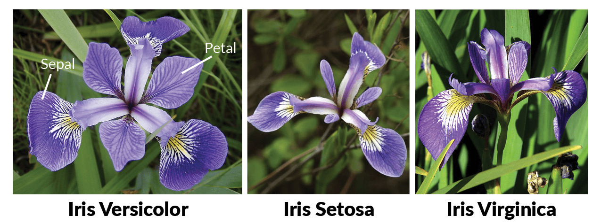

```{r, echo=FALSE, message = FALSE, warning = FALSE}
source("../bin/chunk-options.R")
```

## Presentation of the Workshop Data

In this workshop, we will be working with two sets of data: one is the
`iris` data  from the classic paper by Fisher "The use of multiple measurements in taxonomic problems" (1936) and the
other has a set of physiological observations from a recent paper by O'Keefe and Nippert (ref).  Each dataset is stored
as comma separated value (CSV) file.  We will work with the `iris` data throughout this workshop; the physiological data will be introduced in the next episode.

The `iris` data have morphological measures from more than 100 samples of 3 species of irises.

```{r Teaser, echo=FALSE, eval = TRUE}
library(ggplot2)

ggplot(data = iris,mapping = aes(x = Petal.Width, y = Petal.Length)) +
  geom_point(aes(color = Species)) +
  ggtitle("Iris Petal Length vs Width")

```

Each row holds information for an individual plant observation, and the columns represent the species of the specimen and the lengths and widths of its sepal and petal (in centimeters):

  | Column       |
  |--------------|
  | Sepal.Length |
  | Sepal.Width  |
  | Petal.Length |
  | Petal.Width  |
  | Species      |

<!-- replace this with download and unzip the data dir -->
We are going to use the R function `download.file()` to download the CSV file
that contains the survey data from figshare, and we will use `read.csv()` to
load into memory the content of the CSV file as an object of class `data.frame`. 
Inside the download.file command, the first entry is a character string with the source URL 
<!-- URL??  -->
("https://ndownloader.figshare.com/files/2292169"). This source URL downloads a CSV file from 
figshare. The text after the comma ("data/iris.csv") is the destination of the 
file on your local machine. You'll need to have a folder on your machine called "data" where 
you'll download the file. So this command downloads a file from figshare, names it 
"iris.csv," and adds it to a preexisting folder named "data."

You are now ready to load the data:

```{r read-csv}
iris <- read.csv("data/iris.csv")
```

This statement doesn't produce any output because, as you might recall,
assignments don't display anything. If we want to check that our data has been
loaded, we can see the contents of the data frame by typing its name: `iris`.

Wow... that was a more than a screenful of output.
Let's check the top (the first 6 lines) of this data frame using the
function `head()`:

```{r head}
head(iris)
```

```{r view, eval = FALSE}
## Try also
View(iris)
```

> ### Note
>
> `read.csv` assumes that fields are delineated by commas, however, in several
> countries, the comma is used as a decimal separator and the semicolon (;) is
> used as a field delineator. If you want to read in this type of files in R,
> you can use the `read.csv2` function. It behaves exactly like `read.csv` but
> uses different parameters for the decimal and the field separators. If you are
> working with another format, they can be both specified by the user. Check out
> the help for `read.csv()` by typing `?read.csv` to learn more. There is also the `read.delim()` for 
> in tab separated data files. It is important to note that all of these functions 
> are actually wrapper functions for the main `read.table()` function with different arguments.
> As such, the iris data above could have also been loaded by using `read.table()`
> with the separation argument as `,`. The code is as follows:
> `iris <- read.table(file="data/iris.csv", sep=",", header=TRUE)`.
> The header argument has to be set to TRUE to be able to read the headers as
> by default `read.table()` has the header argument set to FALSE.

## What are data frames?

Data frames are the _de facto_ data structure for most tabular data, and what we
use for statistics and plotting.

A data frame can be created by hand, but most commonly they are generated by the
functions `read.csv()` or `read.table()`; in other words, when importing
spreadsheets from your hard drive (or the web).

A data frame is the representation of data in the format of a table where the
columns are vectors that all have the same length. Because columns are
vectors, each column must contain a single type of data (e.g., characters, integers,
factors). For example, here is a figure depicting a data frame comprising a
numeric, a character, and a logical vector.


We can see this when inspecting the <b>str</b>ucture of a data frame
with the function `str()`:

```{r str}
str(iris)
```

## Inspecting `data.frame` Objects

We already saw how the functions `head()` and `str()` can be useful to check the
content and the structure of a data frame. Here is a non-exhaustive list of
functions to get a sense of the content/structure of the data. Let's try them out!

* Size:
    * `dim(iris)` - returns a vector with the number of rows in the first element,
          and the number of columns as the second element (the **dim**ensions of
          the object)
    * `nrow(iris)` - returns the number of rows
    * `ncol(iris)` - returns the number of columns

* Content:
    * `head(iris)` - shows the first 6 rows
    * `tail(iris)` - shows the last 6 rows

* Names:
    * `names(iris)` - returns the column names (synonym of `colnames()` for `data.frame`
	   objects)
    * `rownames(iris)` - returns the row names

* Summary:
    * `str(iris)` - structure of the object and information about the class, length and
	   content of  each column
    * `summary(iris)` - summary statistics for each column

Note: most of these functions are "generic", they can be used on other types of
objects besides `data.frame`.


> ## Challenge 1
>
> Based on the output of `str(iris)`, can you answer the following questions?
>
> * What is the class of the object `iris`?
> * How many rows and how many columns are in this object?
> * How many species have been recorded during these iris?
>
> > ## Solution to Challenge 1
> > ```{r ch1-soln}
> >
> > str(iris)
> >
> > ## * class: data frame
> > ## * how many rows: 150,  how many columns: 5
> > ## * how many species: 3
> > 
> > ```
> {: .solution}
{: .challenge}

## Indexing and subsetting data frames

Our `iris` data frame has rows and columns (it has 2 dimensions), if we want to
extract some specific data from it, we need to specify the "coordinates" we
want from it. Row numbers come first, followed by column numbers. However, note
that different ways of specifying these coordinates lead to results with
different classes.

```{r bracket-subsetting, eval = FALSE}
# first element in the first column of the data frame (as a vector)
iris[1, 1]   
# first element in the 3rd column (as a vector)
iris[1, 3]   
# first column of the data frame (as a vector)
iris[, 1]    
# first column of the data frame (as a data.frame)
iris[1]      
# first three elements in the 4th column (as a vector)
iris[1:3, 4] 
# the 3rd row of the data frame (as a data.frame)
iris[3, ]    
# equivalent to head_iris <- head(iris)
head_iris <- iris[1:6, ] 
```

`:` is a special function that creates numeric vectors of integers in increasing
or decreasing order, test `1:10` and `10:1` for instance.

You can also exclude certain indices of a data frame using the "`-`" sign:

```{r bracket-subsetting-2, eval = FALSE}
iris[, -1]          # The whole data frame, except the first column
iris[-c(7:150), ] # Equivalent to head(iris)
```

Data frames can be subset by calling indices (as shown previously), but also by calling their column names directly:

```{r bracket-subsetting-name, eval = FALSE}
iris["Species"]       # Result is a data.frame
iris[, "Species"]     # Result is a vector
iris[["Species"]]     # Result is a vector
iris$Species          # Result is a vector
```

In RStudio, you can use the autocompletion feature to get the full and correct names of the columns.

> ## Challenge 2
>
> 1. Create a `data.frame` (`iris_100`) containing only the data in
>    row 100 of the `iris` dataset.
>
> 2. Notice how `nrow()` gave you the number of rows in a `data.frame`?
>
>      * Use that number to pull out just that last row in the data frame.
>      * Compare that with what you see as the last row using `tail()` to make
>        sure it's meeting expectations.
>      * Pull out that last row using `nrow()` instead of the row number.
>      * Create a new data frame (`iris_last`) from that last row.
>
> 3. Use `nrow()` to extract the row that is in the middle of the data
>    frame. Store the content of this row in an object named `iris_middle`.
>
> 4. Combine `nrow()` with the `-` notation above to reproduce the behavior of
>    `head(iris)`, keeping just the first through 6th rows of the iris
>    dataset.
>
> > ## Solution for challenge 2
> > ```{r ch2-soln}
> > ## 1.
> > iris_100 <- iris[100, ]
> > ## 2.
> > # Saving `n_rows` to improve readability and reduce duplication
> > n_rows <- nrow(iris)
> > iris_last <- iris[n_rows, ]
> > ## 3.
> > iris_middle <- iris[n_rows / 2, ]
> > ## 4.
> > iris_head <- iris[-(7:n_rows), ]
> > ```
> {: .solution}
{: .challenge}

## Factors
When we did `str(iris)` we saw that four of the columns consist of
numbers. The column `Species`, ... however, is
of a special class called `factor`. Factors are very useful and actually
contribute to making R particularly well suited to working with data. So we are
going to spend a little time introducing them.
Factors represent categorical data. They are stored as integers associated with labels and they can be ordered or unordered. While factors look (and often behave) like character vectors, they are actually treated as integer vectors by R. So you need to be very careful when treating them as strings.
Once created, factors can only contain a pre-defined set of values, known as
*levels*. By default, R always sorts levels in alphabetical order. For
instance, if you have a factor that represents your experiment locations with 3 levels:
```{r factors}
locations <- factor(c("Madison", "Hancock", "Madison", "Arlington", "Hancock"))
```
R will assign `1` to the level `"Arlington"` and `2` to the level `"Hancock"` and `3` to the level `"Madison"`(
due to alphabetical order, even though the first element in this vector is
`"Madison"`). You can see this by using the function `levels()` and you can find the
number of levels using `nlevels()`:
```{r levels}
levels(locations)
nlevels(locations)
```
Sometimes, the order of the factors does not matter, other times you might want
to specify the order because it is meaningful (e.g., "low", "medium", "high"),
it improves your visualization, or it is required by a particular type of
analysis. Here, one way to reorder our levels in the `locations` vector would be:
```{r relevel}
locations # current order
locations <- factor(locations, levels = c("Madison", "Arlington", "Hancock"))
locations # after re-ordering
```
In R's memory, these factors are represented by integers (1, 2, 3) but are more
informative than integers because factors are self describing: `"Madison"`,
`"Arlington"` is more descriptive than `1`, `2`. Which one is "Arlington"?  You wouldn't
be able to tell just from the integer data. Factors, on the other hand, have
this information built in. It is particularly helpful when there are many levels.

In some cases, you may have to convert factors where the levels appear as
numbers (such as concentration levels or years) to a numeric vector. For
instance, in one part of your analysis the years might need to be encoded as
factors (e.g., comparing average lengths across years) but in another part of
your analysis they may need to be stored as numeric values (e.g., doing math
operations on the years). This conversion from factor to numeric is a little
trickier. The `as.numeric()` function returns the index values of the factor,
not its levels, so it will result in an entirely new (and unwanted in this case)
set of numbers. One method to avoid this is to convert factors to characters,
and then to numbers.

Another method is to use the `levels()` function. Compare:

```{r coersion}
year_fct <- factor(c(1990, 1983, 1977, 1998, 1990))
as.numeric(year_fct)               # Wrong! And there is no warning...
as.numeric(as.character(year_fct)) # Works...
as.numeric(levels(year_fct))[year_fct]    # The recommended way.
```

Notice that in the `levels()` approach, three important steps occur:

* We obtain all the factor levels using `levels(year_fct)`
* We convert these levels to numeric values using `as.numeric(levels(year_fct))`
* We then access these numeric values using the underlying integers of the
  vector `year_fct` inside the square brackets


### Using `stringsAsFactors=FALSE`

By default, when building or importing a data frame, the columns that contain
characters (i.e. text) are coerced (= converted) into factors. Depending on what you want to do with the data, you may want to keep these
columns as `character`. To do so, `read.csv()` and `read.table()` have an
argument called `stringsAsFactors` which can be set to `FALSE`.

In most cases, it is preferable to set `stringsAsFactors = FALSE` when importing
data and to convert as a factor only the columns that require this data
type.


```{r strings-as-factor}
## Compare the difference between our data read as `factor` vs `character`.
iris <- read.csv("data/iris.csv", stringsAsFactors = TRUE)
str(iris)
iris <- read.csv("data/iris.csv", stringsAsFactors = FALSE)
str(iris)
## Convert the column "species" into a factor
iris$Species <- factor(iris$Species)
str(iris)
```


> ## Challenge 3
>
> Part 1. We have seen how data frames are created when using `read.csv()`, but
>   they can also be created by hand with the `data.frame()` function.  There are
>   a few mistakes in this hand-crafted `data.frame`. Can you spot and fix them?
>   Don't hesitate to experiment!
>
> ```{r, eval = FALSE }
>     animal_data <- data.frame(
>               animal = c(dog, cat, sea cucumber, sea urchin),
>               feel = c("furry", "squishy", "spiny"),
>               weight = c(45, 8 1.1, 0.8)
>               )
> ```
>
> Part 2. Can you predict the class for each of the columns in the following 
> example? Check your guesses using `str(country_climate)`:
>      * Are they what you expected?  Why? Why not?
>      * What would have been different if we had added 
>           `stringsAsFactors = FALSE` when creating the data frame?
>      * What would you need to change to ensure that each column had the 
>         accurate data type?
>
> ```{r, eval = FALSE}
>     country_climate <- data.frame(
>            country = c("Canada", "Panama", "South Africa", "Australia"),
>            climate = c("cold", "hot", "temperate", "hot/temperate"),
>            temperature = c(10, 30, 18, "15"),
>            northern_hemisphere = c(TRUE, TRUE, FALSE, "FALSE"),
>            has_kangaroo = c(FALSE, FALSE, FALSE, 1)
>            )
> ```
>
> > ## Solutions to Challenge # 3
> >
> > ### Part 1
> >   * missing quotations around the names of the animals
> >   * missing one entry in the `feel` column (probably for one of the 
> >     furry animals)
> >   * missing one comma in the `weight` column
> > 
> > ### Part 2
> >   * `country`, `climate`, `temperature`, and `northern_hemisphere` are 
> >factors; `has_kangaroo` is numeric
> >   * using `stringsAsFactors = FALSE` would have made character vectors 
> >instead of factors
> >   * removing the quotes in `temperature` and `northern_hemisphere` and
> >     replacing 1
> >     by TRUE in the `has_kangaroo` column would give what was probably 
> > intended
> {: .solution}
{: .challenge}

The automatic conversion of data type is sometimes a blessing, sometimes an
annoyance. Be aware that it exists, learn the rules, and double check that data
you import in R are of the correct type within your data frame. If not, use it
to your advantage to detect mistakes that might have been introduced during data
entry (for instance, a letter in a column that should only contain numbers).

Learn more in this [RStudio tutorial](https://support.rstudio.com/hc/en-us/articles/218611977-Importing-Data-with-RStudio)
